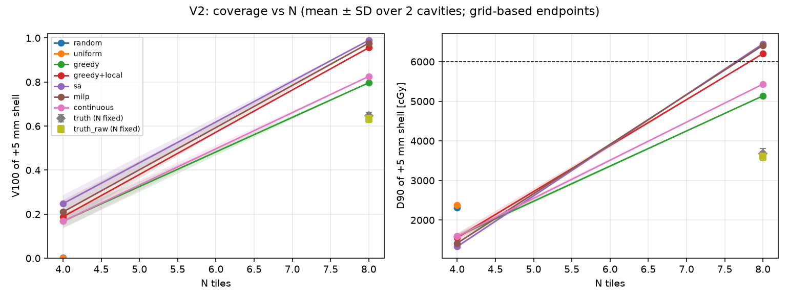
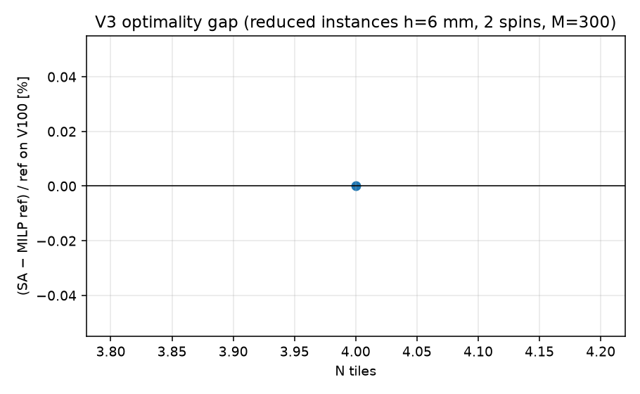
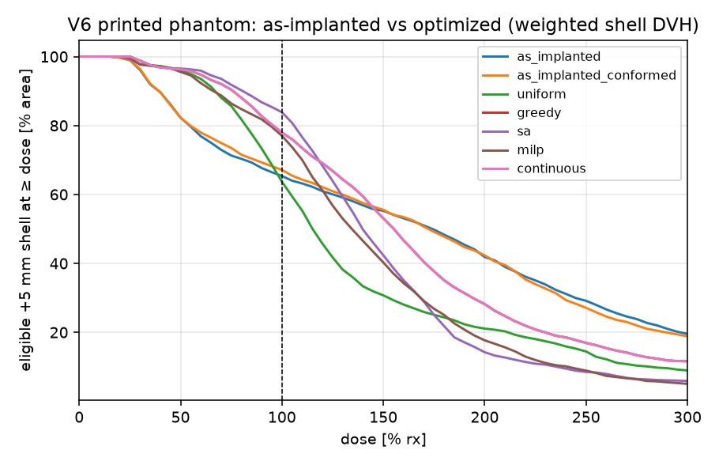

# optimize-notes — measurements and decisions for `gtcore.plan`

Companion to `docs/plan-tile-optimize.md`. Every number here carries the
command, seed, and commit hash that produced it (see "Runs log"). Negative
results stay in.

---

## Parameters

Every tunable is a named constant in `gtcore/plan/__init__.py` with the same
one-line justification as here (§5 of the plan). Sweeps that change a
default must update both.

| Constant | Value | Justification |
|---|---|---|
| `DEFAULT_H_MM` | 2.5 | Anchor spacing = 1/8 tile side: fine re-siting without an exploding candidate count (to be confirmed by V4). |
| `DEFAULT_N_SPINS_FULL` | 6 | Full tile spins 0, 15, …, 75°: the 2×2 seed grid has 90° symmetry. |
| `DEFAULT_N_SPINS_HALF` | 12 | Half tile spins 0, 15, …, 165°: a 10×20 strip has only 180° symmetry. |
| `DETACHED_MM` | 1.5 | Reject a candidate when a conformed seed is more than this off its 3 mm wall offset (half the 2.25–3.75 mm hydrated spread). |
| `DEFAULT_RX_CGY` | 6000 | GammaTile prescription: 60 Gy to the 5 mm shell. |
| `TARGET_SHELL_OFFSET_MM` | 5.0 | Default target = the +5 mm shell (clinical HR-CTV margin). |
| `M_OPT_MAX` | 4000 | Target points kept for optimization: C×M×4 bytes stays < ~100 MB at C ≈ 6000 and an objective evaluation stays ≈ 1 ms. |
| `TAU_FRACTION` | 0.05 | Soft-coverage sigmoid width τ = 0.05·rx: few-percent dose changes get a graded gain for annealing. |
| `LAMBDA_HOT` | 0.5 | P1 penalty per unit V200 above tolerance (plan §2 default). |
| `V200_TOL` | 0.10 | Tolerated V200 before the hot-spot penalty applies (plan §2). |
| `LAMBDA_OAR` | 1e3 | P1 penalty per cGy over an OAR limit: any violation dominates coverage. |
| `LOCAL_RADIUS_MM` | 10.0 | Local-search re-siting radius = half a tile side. |
| `SA_ALPHA` | 0.95 | Geometric cooling per sweep (plan §3 E3). |
| `SA_MOVES_PER_TILE_PER_SWEEP` | 50 | One sweep = 50·N proposed moves. |
| `SA_N_SWEEPS` | 40 | 40 sweeps at α = 0.95 cool T to ≈ 13 % of T0, past the freeze point. |
| `SA_N_RESTARTS` | 3 | One greedy start + two random feasible starts. |
| `MILP_TIME_LIMIT_S` | 60 | HiGHS limit per reduced instance; the bound is the reference when hit. |
| `TILE_AREA_CM2` | 4.0 | Manufacturer: a GammaTile is 2 × 2 cm (tile-count rule, plan §10). |
| `CONFLICT_GAP_MM` | 0.0 | Minimum edge gap beyond the planner's overlap rule (`find_overlapping_tiles`, threshold 1 mm). |

A1 module constants (`gtcore/plan/candidates.py`, `gtcore/plan/conflicts.py`;
implementation tunables, not optimizer parameters):

| Constant | Value | Justification |
|---|---|---|
| `candidates.DENSE_SAMPLES_PER_H2` | 20 | Dense surface samples per h² feeding farthest-point sampling: dense spacing ≈ h/4.5, well below the anchor spacing. |
| `candidates.DENSE_SAMPLES_MIN/MAX` | 500 / 200 000 | Bounds on the dense sample count (tiny / huge eligible regions). |
| `candidates.RAY_CHUNK` | 1000 | Grid points per batched fallback cast: bounds the transient (point, triangle) pair arrays (~2000 pairs per point on a 1 mm marching-cubes mesh). |
| `candidates.FALLBACK_LATERAL_TOL_MM` | 0.5 | Diagnostic only (`grid_fallback_flags`); not used for rejection (decision 10). |
| `candidates.VISIBLE_TOL_MM` | 0.5 | `visible_faces`: a first hit within this distance of the face centroid counts as the face (grazing an edge). |
| `candidates.ELLIPSOID_P` | 1.6075 | Knud Thomsen ellipsoid-area exponent (relative error < 1.1 %). |
| `candidates.MIN_FACES` | 4 | Fewer faces than a tetrahedron is a degenerate mesh (V8). |
| `conflicts.PLANNER_THRESHOLD_MM` | 1.0 | `find_overlapping_tiles`' default threshold; `gap_mm` adds to it (decision 11). |
| `conflicts.PROXY_NORMAL_DOT` | 0.5 | Proxy rule only between tiles on the same wall (anchor inward normals agree; the planner's own dot threshold). |
| `conflicts.PROXY_ANCHOR_MM` | 18.0 | Proxy rule full–full: 10 + 10 − 2 mm (each full tile contains the 10 mm disc about its anchor; 1 mm draping slack per tile). |
| `conflicts.PROXY_ANCHOR_HALF_MM` | 13.0 | Proxy rule full–half: 10 + 5 − 2 mm (coordinator's "10 + 3"). |
| `conflicts.PROXY_ANCHOR_HALF_HALF_MM` | 8.0 | Proxy rule half–half: 5 + 5 − 2 mm (abutting strips, anchors 10 mm apart, stay legal). |
| `conflicts.PROXY_SEED_MM` | 9.0 | Proxy rule: seed pitch 10 mm; seeds of different tiles closer than 9 mm imply overlapping footprints. |
| `conflicts.PAIR_CHUNK` | 512 | Candidate pairs per vectorized sample-distance batch (~30 MB transient). |
| `conflicts.ITEM_CHUNK` | 65 536 | (sample, triangle) pairs per batched point-triangle pass (~30 MB transient). |

---

## Go/no-go (§8)

**Run (coordinator):** `python scripts/go_no_go_optimize.py --seeds 1 2 3 4 5 6`
at commit 5f0105a (all builders merged), 1133 s wall while sharing the CPU
with the full suite. Six synthetic cavities (`make_head_phantom`, 1 mm,
rng seeds 1-6; 24.5-28.6 mL; wall 4178-4636 mm², i.e. 11-12 tiles by the
4 cm² rule), candidates h = 3 mm / 6 spins (1514-1742 candidates, 22-93
rejected as hanging, conflict pairs ~0.5 M, build 22-25 s candidates +
2.5-2.9 s influence + 119-144 s conflicts), target = full +5 mm shell
(6152-6850 area-weighted vertices, no subsample), rx 6000 cGy, greedy =
feasibility-aware forward selection, uniform = farthest-point anchors with
spin 0 skipping conflicting picks, random = 100 random feasible selections.
Metrics from the influence matrix (tabulated kernel); the N = 8 greedy
configuration of each cavity was cross-checked on the exact 1 mm dose grid
(`final_report`): |ΔV100| ≤ 0.6 pp, |ΔD90| ≤ 90 cGy.

| N | greedy V100 mean±SD | uniform V100 mean±SD | random median (mean over cavities) | gain vs uniform, pp, per cavity | cavities with gain ≥ 3 / ≥ 1 pp |
|---|---|---|---|---|---|
| 4 | 0.225 ± 0.011 | 0.011 ± 0.015 | 0.006 | 20.3, 22.1, 22.0, 21.4, 22.3, 20.7 | 6/6 / 6/6 |
| 6 | 0.466 ± 0.025 | 0.305 ± 0.061 | 0.371 | n/a, 19.4, 18.0, 20.7, 10.0, 7.8 | 5/6 / 5/6 |
| 8 | 0.856 ± 0.066 | n/a (could not pack 8) | 0.845 | n/a ×6 | — |

Per cavity (seeds 1-6 in order; "n/a" = the uniform heuristic ran out of
non-conflicting spin-0 anchors before placing N tiles):

```
N=4 greedy V100 0.245 D90 1451 | uniform V100 0.043 D90 2096 | random median 0.005 p95 0.097 | gain 20.3 pp (vs uniform) 24.0 pp (vs random)
N=6 greedy V100 0.514 D90 2675 | uniform V100 nan D90 nan | random median 0.438 p95 0.512 | gain nan pp (vs uniform) 7.6 pp (vs random)
N=8 greedy V100 0.967 D90 6408 | uniform V100 nan D90 nan | random median 0.908 p95 0.976 | gain nan pp (vs uniform) 5.9 pp (vs random)
grid check (N=8 greedy): shell+5 V100 0.967 D90 6399 vs influence V100 0.967 D90 6408
N=4 greedy V100 0.221 D90 1083 | uniform V100 0.000 D90 2058 | random median 0.003 p95 0.097 | gain 22.1 pp (vs uniform) 21.8 pp (vs random)
N=6 greedy V100 0.456 D90 2106 | uniform V100 0.262 D90 4427 | random median 0.342 p95 0.404 | gain 19.4 pp (vs uniform) 11.4 pp (vs random)
N=8 greedy V100 0.792 D90 5059 | uniform V100 nan D90 nan | random median 0.809 p95 0.885 | gain nan pp (vs uniform) -1.7 pp (vs random)
grid check (N=8 greedy): shell+5 V100 0.796 D90 4971 vs influence V100 0.792 D90 5059
N=4 greedy V100 0.221 D90 1307 | uniform V100 0.001 D90 2148 | random median 0.002 p95 0.089 | gain 22.0 pp (vs uniform) 21.8 pp (vs random)
N=6 greedy V100 0.464 D90 2254 | uniform V100 0.284 D90 4409 | random median 0.371 p95 0.434 | gain 18.0 pp (vs uniform) 9.3 pp (vs random)
N=8 greedy V100 0.879 D90 5888 | uniform V100 nan D90 nan | random median 0.852 p95 0.924 | gain nan pp (vs uniform) 2.7 pp (vs random)
grid check (N=8 greedy): shell+5 V100 0.873 D90 5875 vs influence V100 0.879 D90 5888
N=4 greedy V100 0.214 D90 980 | uniform V100 0.000 D90 2184 | random median 0.012 p95 0.094 | gain 21.4 pp (vs uniform) 20.3 pp (vs random)
N=6 greedy V100 0.433 D90 2061 | uniform V100 0.226 D90 4015 | random median 0.313 p95 0.372 | gain 20.7 pp (vs uniform) 12.0 pp (vs random)
N=8 greedy V100 0.774 D90 4461 | uniform V100 nan D90 nan | random median 0.796 p95 0.869 | gain nan pp (vs uniform) -2.2 pp (vs random)
grid check (N=8 greedy): shell+5 V100 0.778 D90 4414 vs influence V100 0.774 D90 4461
N=4 greedy V100 0.234 D90 1273 | uniform V100 0.010 D90 1949 | random median 0.010 p95 0.107 | gain 22.3 pp (vs uniform) 22.4 pp (vs random)
N=6 greedy V100 0.474 D90 2587 | uniform V100 0.374 D90 4157 | random median 0.378 p95 0.445 | gain 10.0 pp (vs uniform) 9.7 pp (vs random)
N=8 greedy V100 0.895 D90 5967 | uniform V100 nan D90 nan | random median 0.853 p95 0.926 | gain nan pp (vs uniform) 4.1 pp (vs random)
grid check (N=8 greedy): shell+5 V100 0.898 D90 5991 vs influence V100 0.895 D90 5967
N=4 greedy V100 0.217 D90 1178 | uniform V100 0.010 D90 1857 | random median 0.001 p95 0.099 | gain 20.7 pp (vs uniform) 21.5 pp (vs random)
N=6 greedy V100 0.455 D90 2331 | uniform V100 0.377 D90 4396 | random median 0.384 p95 0.439 | gain 7.8 pp (vs uniform) 7.1 pp (vs random)
N=8 greedy V100 0.831 D90 5463 | uniform V100 nan D90 nan | random median 0.852 p95 0.941 | gain nan pp (vs uniform) -2.1 pp (vs random)
grid check (N=8 greedy): shell+5 V100 0.830 D90 5508 vs influence V100 0.831 D90 5463
```

**Verdict against the pre-declared rule:** gain ≥ 3 pp of V100 over
uniform on most cavities at N = 4 (6/6) and N = 6 (5/6) → proceed with §3
as written. Two observations that shape the rest of the campaign:

1. **N = 8 is packing-limited on these cavities** (8 of the 11-12 tiles the
   4 cm² rule calls for): the uniform heuristic cannot place 8 tiles at all,
   and greedy beats the random-feasible median by only +5.9/-1.7/+2.7/-2.2/
   +4.1/-2.1 pp (below the random median on 3/6). Consistent with the §7.1
   and §7.4 scouts: forward selection is myopic once the wall is nearly
   full, so V2 must compare greedy+local, SA and the continuous solver at
   N ≥ 8, and the planner default follows V2, not this experiment.
2. **Greedy maximizes V100 at the expense of D90**: at N = 4 and 6 the
   uniform heuristic's D90 is 1.5-2x greedy's (e.g. seed 2, N = 6: uniform
   D90 4427 cGy vs greedy 2106 cGy) because spreading tiles lifts the cold
   10 % of the shell while clustering lifts the covered fraction. P2
   (minimum N with D90 ≥ rx) therefore needs the N-sweep to be judged on
   D90, and the "D90 ≥ rx" criterion will be met later in N than the
   "V100 ≥ 0.90" criterion for V100-driven solvers (§7.1's D90-direct
   objective was tested by the scout and rejected for V100, but remains the
   right readout for P2).


_Not yet run._ Protocol: synthetic cavities, candidates at h = 3 mm, 6 spins,
influence on the +5 mm shell, greedy only; V100/D90 vs the uniform heuristic
and random feasible placements for N = 4, 6, 8.

| cavity (seed, volume) | N | V100 greedy | V100 uniform | V100 random (median / p95) | gain (pp) |
|---|---|---|---|---|---|

Verdict: _pending_ (≥ 3 pp → §3 as written; 1–3 pp → §7.7 framing; < 1 pp → stop, §7.1).

---

## V1 Unit / consistency

_Partly done._ Influence gate (§3 B) and weighted quantiles: below (A2).
Still pending: conflict symmetry and clique/pairwise agreement; greedy never
violates a conflict; SA reproducible from seed; MILP equals brute force on
the toy instance; the planner never flags an optimizer output as overlapping.

### A2 influence gate (§3 B)

`tests/test_plan_influence.py::test_influence_gate` — synthetic cavity
`make_head_phantom(spacing=1.0, n_tiles=3, rng_seed=1)`, wall mesh from
`mask_to_mesh(truth.masks["cavity"], vol.affine)` (6152 vertices, watertight),
12 full-tile candidates at farthest-point anchors (spin 0, hand-built with
`conform_tile`; A1's `build_candidates` not used), target = the FULL +5 mm
shell (`TargetSet.from_shell`, M = 6152, no subsample, shell-area weights).
Row-sum (tabulated kernel) vs `compute_dose_grid(exact=True, spacing_mm=1.0)`
on mesh bounds ± 15 mm, trilinearly sampled at the same points
(`sample_doses`), both reduced with the same weighted metrics
(`objective.metrics_from_dose`). Five seeded draws (`default_rng(0)`) of
1–8 candidates:

| selection | V100 row / grid | D90 row / grid [cGy] |
|---|---|---|
| [0, 2, 3, 6, 8, 10, 11] | 0.6992 / 0.6991 | 4364 / 4367 |
| [2, 3, 4, 5, 6, 8, 10, 11] | 0.8475 / 0.8480 | 5677 / 5680 |
| [0, 1, 3, 5, 6, 8, 10] | 0.7273 / 0.7283 | 4830 / 4828 |
| [8] | 0.0000 / 0.0000 | 274 / 274 |
| [2, 4, 5, 6, 8] | 0.2526 / 0.2536 | 2652 / 2653 |

**Max deviation: |ΔV100| = 0.103 pp (gate 0.5 pp), |ΔD90| = 0.042 % of rx
(gate 1 %)**; max point-wise relative difference at points ≥ 0.5 rx is
5.2e-3 — the trilinear interpolation of the 1 mm grid, not the kernel
(tabulated vs exact rows agree to < 2e-3 in
`test_build_influence_matches_dose_at_points_rows`). Cheap flat-wall gate
(`test_influence_gate_flat_wall`, toy tiles, 400 equal-weight points at
z = +5): |ΔV100| = 0.000 pp, |ΔD90| = 0.033 % rx, point rel 2.9e-3.
Command: `python -m pytest -q -s tests/test_plan_influence.py`; seeds
phantom 1, draws 0; commit 5ea6f95. Whole module ≈ 13–20 s.

Weighted quantile: `objective.weighted_quantile` (weighted inverted CDF)
equals `numpy.percentile(method="inverted_cdf")` for unit weights over
n ∈ {1 … 1001} and 81 q values each, except where `n·q` overshoots an integer
by floating-point rounding (e.g. 25 × 0.28 = 7.000000000000001): numpy then
steps to element k + 1, ours returns element k (the definition); tested
explicitly (`test_weighted_quantile_unit_weights_matches_numpy_inverted_cdf`).
A3 (`tests/test_plan_solvers.py`, 26 tests): greedy never violates a
conflict (both toys, every N up to the packing limit) and is deterministic;
`fixed` ids are kept; an infeasible N fails with `status="infeasible"` and a
reason naming "4 of 5"; feasibility-aware greedy packs N = 9 on the 60-toy
where plain greedy stalls at 7; local search never decreases the hard
objective, ends feasible and is a fixed point of itself; SA is reproducible
from its seed (selection and history identical), feasible, and ≥ greedy on
both toys; `sweep_n` greedy rows are monotone in V100; E5 and
`solve_continuous` never lower V100 and never introduce an overlap on the
flat wall with the real engine; the evaluator routes through
`Objective.hard` / `metrics` / `gains_all` when they are real.

_Pending (other branches)._ Influence gate (§3 B); weighted quantiles; conflict symmetry and
clique/pairwise agreement; greedy never violates a conflict; SA reproducible
from seed; MILP equals brute force on the toy instance; the planner never
flags an optimizer output as overlapping.

## Conflict rule used by the campaign (A5, 2026-10-07; applies to V2–V8)

**Defect found.** `gtcore.interact.find_overlapping_tiles` misses real
footprint overlaps on the phantom cavities, so A1's `build_conflicts` (which
calls it) has holes and every solver exploited them. Evidence on cavity s1
(scale 1.0, h = 4 mm / 3 spins, C = 433): greedy N = 4 selected tiles 76 and
187 — anchors 13.1 mm apart, anchor normals dot 0.75, nearest seeds of the two
tiles 1.9 mm apart, reconstructed footprint clouds 0.62 mm apart — and
`find_overlapping_tiles([t76, t187]) == []`. Over all candidate pairs with
anchor chord < 18 mm and normal dot > 0.5 (a certain overlap: each full tile
contains the 10 mm disc about its anchor) 565 of 20 869 (2.7 %) are absent
from `conflicts.pairs`; 9 of 433 candidates have an exploded footprint
reconstruction (> 25 mm from the anchor). Root cause: the quadratic
height-field least squares in `interact._footprint_surface` (rcond = 1e-6)
degenerates on (near-)symmetric placements — on an r = 25 mm icosphere two
tiles 3 mm apart produce footprint samples 1121 mm away and are not flagged
(r = 12 mm works). Pre-existing primitive; the planner's overlap caution has
the same blind spot. Reported to the coordinator (2026-10-07) and now being
adopted in the library (`build_conflicts(robust=True)`, continuous solver
acceptance test).

**Rule used here: conflict = planner rule ∪ geometric proxy.** Before any
solver runs, the validation script augments the instance's `ConflictGraph`
with the proxy — two tiles conflict when their anchor normals agree
(dot > 0.5) and either the anchor chord is < 18 mm (full/full; 9 mm when a
half tile is involved) or any inter-tile seed pair is < 9 mm apart (every
seed is 5 mm inside its tile edge; 9 mm leaves 1 mm for the planner's
threshold) — and records `n_pairs_planner` / `n_pairs_added` per instance
(≈ 2.7–4.2 % added on the scale-1.0 cavities). Every returned plan,
including the continuous solver's poses (which cannot be augmented because
the solver tests overlap internally), is re-checked with the proxy and
recorded as a FAILED row when it overlaps. Every table below carries the
caption "conflict rule = planner ∪ geometric proxy".

## V2 Synthetic benchmark

### Declared design (A5, 2026-10-07, written BEFORE any arm was run)

Script: `python scripts/validation_optimize.py --section v2` (`--quick` = seeds
1–2, scale 1.0, N ∈ {4, 8}, n_random = 10). Outputs `output/validation_optimize/v2_*.csv`,
`v2_coverage_vs_n.png`, `v2_configs.pkl`; every run appends to `runs.csv`.

**Cavity grid.** `make_head_phantom(spacing=1.0, n_tiles=8, rng_seed=s)` for
seeds s ∈ {1, 2, 3, 4, 5, 6} × radius scales {0.8, 1.0, 1.25} = 18 cavities.
The generator has no size parameter; the scale multiplies the module
constant `CAVITY_RADII` = (20, 18, 17) mm around the call (nothing in the
generator is edited). Volumes = cavity-mask voxels × 1 mm³ (seed voxels
excluded), measured on seeds 1–2:

| scale | radii (mm) | volume (mL) | wall area (mm²) | manufacturer-rule tiles |
|---|---|---|---|---|
| 0.8 | 16.0 / 14.4 / 13.6 | 12.4, 14.0 | 2678, 2914 | 7, 8 |
| 1.0 | 20.0 / 18.0 / 17.0 | 24.4, 27.6 | 4178, 4561 | 11, 12 |
| 1.25 | 25.0 / 22.5 / 21.3 | 47.8, 54.2 | 6527, 7123 | 17, 18 |

The full table (all 18) is printed by the script as the first V2 block. Every
phantom carries 8 truth tiles regardless of scale (the generator's own
rejection-sampled placement), so the 0.8-scale truth implants are dense and
the 1.25-scale ones sparse — stated, not corrected.

**N list.** N ∈ {4, 6, 8, 10, 12} (12 added because the manufacturer rule gives
11–12 tiles for the scale-1.0 cavities; coordinator note 2026-10-07). On the
0.8-scale cavities N = 10, 12 may be packing-infeasible: such arm rows are
recorded as FAILED with `n_placed`, never as a lower score. An arm "fails"
when it returns fewer than N tiles, a conflicting selection (planner rule or
proxy), or a status other than ok/optimal/time_limit.

**Target.** `TargetSet.from_shell(mesh, 5)` (+5 mm shell, shell-area weights),
rx = 6000 cGy. Discrete candidate grid h = 4 mm, **6 spins**, M_opt = 1000.
The coordinator's default was h = 4 / 3 spins "unless V4 says otherwise";
the quick V4 run (`--quick`, 2026-10-07) said otherwise for packing: at
h = 4 / 3 spins the enumeration proves no 8-tile selection exists on the
24 mL cavity s1 (77 608 nodes), while h = 4 / 6 spins packs 8 at V100 0.999
(greedy) — see V4.

**Arms** (per cavity × N): `random` (n_random = 20 feasible draws from the
candidate set — declared 50, trimmed to 20 for the overnight budget on the
coordinator's instruction; median and 95th percentile of V100 / D90; up to
500 draw attempts), `uniform` (farthest-point anchors over the distinct
eligible anchors, spin-0 candidate, next FPS point when a pick conflicts;
when the spin-0 pass ends short of N a second deterministic pass allows the
other spins at the same FPS anchors — `uniform_spin_fallback` counts those
picks; local implementation in the script), `greedy` (feasibility-aware,
`candidates=` passed), `greedy+local`, `sa` (seed 1000 + cavity seed), `milp`
(reduced instance h = 6 mm / 2 spins / M = 300, `solve_milp(method="auto")`
→ enumeration branch-and-bound, 300 s limit, N ∈ {4, 6, 8} only; coverage
only), `continuous` (A3's `solve_continuous` started from the instance
objective's greedy solution, wall-time budget = greedy + SA wall time on the
same instance), `truth` (the phantom's truth tiles re-draped by
`conform_tile` at their own anchor, N = 8 fixed) and `truth_raw` (the raw
truth seeds, N = 8 fixed).

**Endpoints.** V100, D90, V150, V200 of the +5 mm shell vertices and the
weighted V100 of the full target, all from `final_report` (`compute_dose_grid`,
exact kernel, 1 mm, mesh bounds + 15 mm) — never from the influence matrix;
solver wall time; `n_placed`; overlap count (planner rule).

**Statistics.** Mean ± SD across cavities per (N, arm); paired differences
with t-based 95 % CI and Wilcoxon signed-rank p for SA − greedy, SA − uniform,
greedy − uniform, (greedy+local) − greedy, SA − random (median), continuous − SA,
continuous − uniform.

**PRIMARY ENDPOINT.** SA − uniform on +5 mm-shell V100 at N*, where N* is,
per cavity, the smallest N in the list at which the uniform arm first reaches
D90 ≥ rx (if never: N* = 12 and the cavity is flagged in `v2_primary.csv`).
Paired mean difference, 95 % CI, Wilcoxon p across the 18 cavities. No
post-hoc switching. Amendment before the full run (after the quick run
showed packing-limited arms at large N): when the SA or uniform row at N*
is FAILED/skipped, the cavity contributes the pair at the largest N where
both arms succeeded, flagged `fallback` in the table; cavities with no such N
are counted (`n_no_pair`) and excluded.

### Results

_Pending A1–A4._ Smoke run at the Phase 0 stubs (commit cd73082,
`--quick`, 2026-10-07): only the two truth arms could run — V100 / D90 of the
conformed truth tiles 0.658 / 3772 cGy (seed 1) and 0.634 / 3594 cGy (seed 2);
raw seeds 0.647 / 3703 and 0.622 / 3539. Eight 3.5 U truth tiles do not reach
rx at +5 mm on these phantoms, and the planner's overlap rule flags 13–16
pairs among the conformed truth tiles (the generator packs tiles by seed
clearance, not footprint). Both numbers are references for the optimizer
arms, not results.

<!-- campaign:V2 -->
## validation_optimize run 2026-10-07 04:24 — commit d42d6c4 — `python scripts/validation_optimize.py --quick`

Seeds (1, 2) × scales (1.0,); N (4, 8); n_random 10; rx 6000 cGy; grid 1 mm; report margin 15 mm; h 4 mm; 3 spins; M_opt 1000; MILP reduced h 6 mm / 2 spins / M 300 / 300 s, N in (4, 8).

### V2 — `--quick` run under the augmented rule (mean ± SD across cavities; +5 mm shell, grid based)

| N | arm | n_cav | V100 | D90 [cGy] | V150 | V200 | solve s |
|---|---|---|---|---|---|---|---|
| 4 | random | 2 | 0.002 ± 0.001 | 2309 ± 103 | 0.000 ± 0.000 | 0.000 ± 0.000 | 0.0 |
| 4 | uniform | 2 | 0.000 ± 0.000 | 2376 ± 50 | 0.000 ± 0.000 | 0.000 ± 0.000 | 0.0 |
| 4 | greedy | 2 | 0.168 ± 0.032 | 1589 ± 63 | 0.000 ± 0.000 | 0.000 ± 0.000 | 0.1 |
| 4 | greedy+local | 2 | 0.189 ± 0.004 | 1560 ± 104 | 0.000 ± 0.000 | 0.000 ± 0.000 | 0.1 |
| 4 | sa | 2 | 0.248 ± 0.040 | 1331 ± 37 | 0.000 ± 0.000 | 0.000 ± 0.000 | 1.4 |
| 4 | milp | 2 | 0.210 ± 0.053 | 1417 ± 34 | 0.000 ± 0.000 | 0.000 ± 0.000 | 1.5 |
| 4 | continuous | 2 | 0.168 ± 0.032 | 1589 ± 63 | 0.000 ± 0.000 | 0.000 ± 0.000 | 1.5 |
| 8 | greedy | 1 | 0.797 ± 0.000 | 5137 ± 0 | 0.170 ± 0.000 | 0.000 ± 0.000 | 0.1 |
| 8 | greedy+local | 1 | 0.956 ± 0.000 | 6202 ± 0 | 0.085 ± 0.000 | 0.000 ± 0.000 | 0.2 |
| 8 | sa | 1 | 0.990 ± 0.000 | 6452 ± 0 | 0.008 ± 0.000 | 0.000 ± 0.000 | 1.5 |
| 8 | milp | 1 | 0.977 ± 0.000 | 6413 ± 0 | 0.000 ± 0.000 | 0.000 ± 0.000 | 3.1 |
| 8 | continuous | 1 | 0.826 ± 0.000 | 5434 ± 0 | 0.166 ± 0.000 | 0.000 ± 0.000 | 1.6 |
| 8 | truth | 2 | 0.646 ± 0.017 | 3683 ± 126 | 0.382 ± 0.038 | 0.028 ± 0.020 | 0.0 |
| 8 | truth_raw | 2 | 0.635 ± 0.017 | 3621 ± 116 | 0.380 ± 0.035 | 0.048 ± 0.020 | 0.0 |

Paired differences in V100 (pp), t-based 95 % CI, Wilcoxon signed-rank:

| N | comparison | mean_pp | ci_lo_pp | ci_hi_pp | n | wilcoxon_p |
|---|---|---|---|---|---|---|
| 4 | sa - greedy | 7.95 | 1.17 | 14.73 | 2 | 0.500 |
| 4 | sa - uniform | 24.75 | -10.42 | 59.92 | 2 | 0.500 |
| 4 | greedy - uniform | 16.80 | -11.58 | 45.19 | 2 | 0.500 |
| 4 | greedy+local - greedy | 2.02 | -23.63 | 27.66 | 2 | 1.000 |
| 4 | sa - random | 24.56 | -9.76 | 58.88 | 2 | 0.500 |
| 4 | continuous - sa | -7.95 | -14.73 | -1.17 | 2 | 0.500 |
| 4 | continuous - uniform | 16.80 | -11.58 | 45.19 | 2 | 0.500 |
| 8 | sa - greedy | 19.30 | — | — | 1 | 1.000 |
| 8 | greedy+local - greedy | 15.92 | — | — | 1 | 1.000 |
| 8 | continuous - sa | -16.41 | — | — | 1 | 1.000 |

**Primary endpoint** (SA − uniform, V100 at N*): 24.75 pp [-10.42, 59.92], n = 2, Wilcoxon p = 0.500, 2 cavities where uniform never reached D90 ≥ rx.

FAILED arm rows (fewer than N tiles / conflict / bad status; excluded from all statistics):

| cavity | N | arm | n_placed | reason |
|---|---|---|---|---|
| s1_x1.00 | 8 | greedy | 7 | FAILED (n_placed=7): greedy status infeasible: no compatible candidate left after placing 7 of 8 tiles |
| s1_x1.00 | 8 | greedy+local | 7 | FAILED (n_placed=7): greedy infeasible: no compatible candidate left after placing 7 of 8 tiles |
| s1_x1.00 | 8 | sa | 7 | FAILED (n_placed=7): sa status infeasible: greedy start failed: no compatible candidate left after placing 7 of 8 tiles |
| s1_x1.00 | 8 | milp | 0 | FAILED (n_placed=0): milp status infeasible: no 8-candidate selection satisfies the conflict / OAR rows (77608 nodes searched) |
| s1_x1.00 | 8 | continuous | 0 | FAILED (n_placed=0): continuous status infeasible: no feasible 8-tile start found among 433 candidates |

Skipped arms:

| arm | reason |
|---|---|
| random | skipped: random: no feasible 8-tile draw in 500 tries |
| uniform | skipped: uniform: only 6 of 8 non-conflicting anchors (spin fallback included) |

_v2: 170 s wall._



<!-- /campaign:V2 -->

## V3 Optimality gap

Script: `--section v3` (seeds 1–6, scale 1.0, N ∈ {4, 6, 8}) on the reduced
instance h = 6 mm / 2 spins / M = 300 (coordinator, 2026-10-07), solved with
`solve_milp(method="auto")` (enumeration branch-and-bound when C ≤ 600 and
N ≤ 8; HiGHS otherwise), 300 s limit: gap = (V100_SA − ref) / ref with V100
from the influence matrix (what the MILP optimizes; coverage only) and
ref = MILP incumbent, or the MILP bound when `status == "time_limit"`. SA runs
on the same reduced instance; when its greedy start cannot pack N, SA is
restarted from the enumeration's selection (`sa_start = milp`), otherwise
the row is FAILED with the reason (never dropped). Grid V100 of both
selections, and of the continuous arm (budget = greedy + SA), reported
alongside. Figure `v3_gap.png`.

_Pending A3–A4._
_Pending for SA._ (SA − MILP)/MILP on V100 over reduced instances; MIP gap
stated when the time limit was hit.

### A4 MILP on the toy instance

`gtcore.plan.milp` (branch `plan/milp`, based on cd73082; measurements from
the A4 commit's working tree). Command:
`python -m pytest -q tests/test_plan_milp.py` (20 tests, 17 s) asserts every
status / optimum below; the timings are from direct `solve_milp` /
`brute_force` calls on the same `toy_instance(...)` arguments (rng_seed 0) in
one interpreter session; scipy 1.18.1 / HiGHS; AMD Ryzen 5 7600X, 32 GB,
single thread. Coverage only
(V100); hot-spot terms are not in the MILP (§3 E4). Brute force enumerates
every conflict-free subset with the same OAR rows.

| instance (`toy_instance` args) | C | M | pairs / cliques | rows / nnz | N | status | V100 (MILP = brute force) | bound | gap | time |
|---|---|---|---|---|---|---|---|---|---|---|
| `n_candidates=12, n_targets=150` (pitch 10) | 12 | 150 | 57 / 12 | 208 / 2076 | 1 | optimal | 0.3133 | 0.3133 | 0 | 0.06 s |
| same | | | | | 2 | optimal | 0.6733 | 0.6733 | 0 | 0.08 s |
| same | | | | | 3 | infeasible (max independent set = 2) | — | — | — | 0.01 s |
| `…, pitch_mm=15` | 12 | 150 | 29 / 4 | 180 / 2020 | 1 | optimal | 0.1800 | 0.1800 | 0 | 0.10 s |
| same | | | | | 2 | optimal | 0.4867 | 0.4867 | 0 | 1.1 s |
| same | | | | | 3 | optimal | 0.6800 | 0.6800 | 0 | 0.5 s |
| same | | | | | 4 | optimal | 0.8267 | 0.8267 | 0 | 0.04 s |
| `n_candidates=80, n_targets=300` (pitch 10) | 80 | 300 | 712 / 80 | 381 / 24 998 | 6 | time_limit (0.5 s) | incumbent 0.5467 | 0.9967 | 0.82 | 0.5 s, 0 nodes |
| same | | | | | 6 | time_limit (60 s) | incumbent 0.8700 | 0.9933 | 0.14 | 60 s, 17 440 nodes |

LP relaxation (`lp_bound`): 0.843 / 0.953 for the pitch-15 toy at N = 2 / 3
(MILP optimum 0.487 / 0.680) and 1.000 for the 80-candidate toy at N = 6 —
weak, as expected: fractional `x` spreads dose over every point.

Findings. (1) MILP = brute force on every feasible (instance, N), to 1e-9 on
V100; pairwise-only and clique+pairwise formulations give the same optimum;
pruning at 1e-3·rx drops nothing on the toy (inverse-square dose never falls
below 1e-3·rx within 250 mm) and at 0.05·rx drops 6 entries without changing
the optimum. (2) **Negative result for §7.3:** the 80-candidate toy at N = 6
is not solved in 60 s (gap 14 %); neither the LP bound (1.00) nor the MILP
dual bound (0.993) is within 5 % of the incumbent (0.870). The toy grid is
highly symmetric (one spin, regular 10 mm pitch), which is the worst case
for branch-and-bound; real reduced instances (coarser h, few spins) may
behave differently and V3 must report the gap per instance. See Open
decisions 12 for the candidate tightenings.

#### Pigeonhole cover cuts (coordinator follow-up, same commit series)

Rows `y_m ≤ Σ_{c : D[c,m] ≥ rx/N} x_c` (valid for both count forms: a covered
point gets ≥ rx from ≤ N candidates, so one gives ≥ rx/N) plus fixing
`y_m = 0` for points with no candidate at ≥ rx/N. Keyword `cover_cuts` on
`solve_milp` / `lp_bound` / `build_formulation`. Same command/seeds as above;
the toy80 rows are from an uncontended rerun (an earlier run overlapped a
pytest run and gave 6047 / 2817 nodes instead; node counts vary between HiGHS
runs at a time limit).

| instance, N | cuts | status | incumbent V100 | bound | gap | nodes | rows / nnz | fixed y=0 | LP bound |
|---|---|---|---|---|---|---|---|---|---|
| pitch-15 toy, N=1 | off / on | optimal / optimal | 0.1800 / 0.1800 | — | 0 / 0 | — | 162 / 244 | 0 / 34 | 0.5335 / **0.1800** |
| pitch-15 toy, N=2 | off / on | optimal / optimal | 0.4867 / 0.4867 | — | 0 / 0 | — | 162 / 288 | 0 / 12 | 0.8432 / **0.6046** |
| pitch-15 toy, N=3 | off / on | optimal / optimal | 0.6800 / 0.6800 | — | 0 / 0 | — | 162 / 312 | 0 / 0 | 0.9531 / 0.8973 |
| pitch-15 toy, N=4 | off / on | optimal / optimal | 0.8267 / 0.8267 | — | 0 / 0 | — | 162 / 312 | 0 / 0 | 0.9664 / 0.9659 |
| toy80, N=6, 0.5 s | off | time_limit | 0.5467 | 0.9967 | 0.82 | 0 | 381 / 24 998 | 0 | 1.0000 |
| toy80, N=6, 0.5 s | on | time_limit | 0.0067 | 1.0000 | 149 | 0 | 681 / 33 945 | 0 | 1.0000 |
| toy80, N=6, 60 s | off | time_limit | 0.8667 | 0.9967 | 0.150 | 8305 | 381 / 24 998 | 0 | 1.0000 |
| toy80, N=6, 60 s | on | time_limit | 0.7867 | 0.9933 | 0.263 | 3557 | 681 / 33 945 | 0 | 1.0000 |

Verdict. The optimum is unchanged everywhere (= brute force; test
`test_cover_cuts_do_not_change_optimum` covers N = 1–4, both count forms).
The cuts bite only when rx/N is large: on the pitch-15 toy they make the LP
bound exact at N = 1 and ~30 % tighter at N = 2, and fix 34 / 12 uncoverable
points. On toy80 at N = 6 (rx/6 is reached by many candidates per point) they
tighten nothing — the dual bound is the same, the LP bound stays 1.0 — and
the extra 300 rows cost node throughput, so the 60 s incumbent is worse
(0.787 vs 0.867). Defaults therefore: `COVER_CUTS = False` for `solve_milp`,
`LP_COVER_CUTS = True` for `lp_bound` (a valid row never loosens an LP). The
§7.3 negative result stands: no bound within 5 % of the incumbent on this toy.

#### Enumeration branch-and-bound (`solve_enumeration`, the §7.3 scout's `--bb`)

Port of the scout's exact DFS over conflict-free N-subsets (fixed candidate
order, every subset once; incremental conflict masks; OAR limits pruned at
each node; incumbent from `solve_greedy` when implemented, else `start` or
the first leaf). Node bound: with r tiles left and current dose d, a newly
covered m needs ≥ (rx − d_m)/r from one new tile, so gain ≤ sum of the r
largest w({m uncovered : D[c,m] ≥ (rx − d_m)/r}) over the allowed c. At the
time limit `bound` = max(incumbent, bound of every open node). `solve_milp`
now routes with `method="auto"`: enumeration when C ≤ 600 and N ≤ 8
(`ENUM_MAX_C`, `ENUM_MAX_N`), HiGHS otherwise; `method="enum"|"highs"` force.
Same instances / seed / hardware as above; direct calls, uncontended.

| instance | N | enumeration (order=degree) | nodes | time | HiGHS (60 s, no cuts) for comparison |
|---|---|---|---|---|---|
| pitch-10 toy (C=12) | 1 / 2 / 3 | optimal 0.3133 / 0.6733 / infeasible | 1 / 13 / 19 | < 0.01 s | same |
| pitch-15 toy (C=12) | 1 / 2 / 3 / 4 | optimal 0.1800 / 0.4867 / 0.6800 / 0.8267 | 1 / 13 / 45 / 64 | < 0.05 s | same (0.04–1.1 s) |
| toy80 (C=80, M=300) | 4 | **optimal 0.5833** | 37 772 | 1.0 s | 5 s: time_limit, incumbent 0.5433, bound 0.8833 |
| toy80 | 6 | **optimal 0.9033** | 1 304 394 | 34.2 s | 60 s: time_limit, incumbent 0.8667, bound 0.9967 (gap 0.15) |
| toy80 | 8 | **optimal 1.0000** | 509 530 | 10.0 s | — |
| toy80, 0.05 s limit | 6 | time_limit, incumbent 0.84, bound 1.00 | 1 958 (169 open) | 0.05 s | — |

`order="potential"` (the scout's weighted-dose-potential order) gives the
same optima with 63–71 nodes on the toys (table uses the default
"single-coverage, then degree" order). Both count forms (exact N and ≤ N)
match brute force on every toy case (`test_enumeration_equals_brute_force`).

Findings. The enumeration proves the toy80 optimum at N = 6 in 34 s where
HiGHS had stalled at 60 s with a 0.867 incumbent (4 % below the true
optimum 0.903) and a 0.997 bound; the true V3 gap of that HiGHS incumbent
was 0.04, not the reported 0.15. This matches the scout's finding on real
synthetic cavities (C = 138–498: HiGHS gaps 67–460 %, enumeration 4–237 s).
The HiGHS path stays as the fallback above the size limits and as an
incumbent finder; its bound must be reported as "loose" in V3. No synthetic
cavity run here: A1 (`build_candidates`) is not on main as of this commit
(`git log main` shows A2 and A3 merged only), so the V3 cavity rows wait for
sync point (1).

<!-- campaign:V3 -->
## validation_optimize run 2026-10-07 04:24 — commit d42d6c4 — `python scripts/validation_optimize.py --quick`

Seeds (1, 2) × scales (1.0,); N (4, 8); n_random 10; rx 6000 cGy; grid 1 mm; report margin 15 mm; h 4 mm; 3 spins; M_opt 1000; MILP reduced h 6 mm / 2 spins / M 300 / 300 s, N in (4, 8).

### V3 — `--quick` run under the augmented rule: optimality gap

Reference = MILP incumbent V100 (influence matrix, coverage only), or the MILP bound when the time limit (300 s) was hit. Gap over 2 instances: mean 0.00 %, min 0.00 %, max 0.00 %, time-limit hits: 0.

| cavity | N | V100_sa_influence | V100_milp_influence | milp_status | milp_method | milp_bound | mip_gap | gap | V100_sa_grid | V100_milp_grid | V100_continuous_grid | gap_continuous_grid | milp_s | continuous_s |
|---|---|---|---|---|---|---|---|---|---|---|---|---|---|---|
| s1_x1.00 | 4 | 0.277 | 0.277 | optimal | enum_bb | 0.277 | 0.000 | 0.0000 | 0.248 | 0.248 | 0.235 | -0.0511 | 1.1 | 1.1 |
| s2_x1.00 | 4 | 0.210 | 0.210 | optimal | enum_bb | 0.210 | 0.000 | 0.0000 | 0.172 | 0.172 | 0.094 | -0.4560 | 1.8 | 1.0 |

`gap_continuous_grid` compares grid V100 of the continuous solver against the MILP incumbent's grid V100 (the continuous solver has no influence-matrix objective; it may exceed the discrete MILP because it is not restricted to the candidate grid).

_v3: 19 s wall._



<!-- /campaign:V3 -->

## V4 Discretization

Script: `--section v4` (seeds 1–2, scale 1.0, N = 8): h ∈ {4, 3, 2.5} mm ×
n_spins ∈ {3, 6} plus (4 mm, 12 spins); greedy, SA and continuous (same
budget) per cell; candidate / conflict / influence build time; E5
`refine_continuous` gain on the SA solution (grid V100 before / after).
Grid trimmed for the overnight budget: `build_conflicts` is O(C²) exact
footprint tests (quick run: 345 s at C = 2492 for h = 2.5 / 6 spins; h = 2 mm
would give ≈ 6300 candidates), so h = 2 mm, (2.5 mm, 6 spins) and 12 spins
below h = 4 mm were dropped.

_Pending A1–A3._

<!-- campaign:V4 -->
## validation_optimize run 2026-10-07 04:24 — commit d42d6c4 — `python scripts/validation_optimize.py --quick`

Seeds (1, 2) × scales (1.0,); N (4, 8); n_random 10; rx 6000 cGy; grid 1 mm; report margin 15 mm; h 4 mm; 3 spins; M_opt 1000; MILP reduced h 6 mm / 2 spins / M 300 / 300 s, N in (4, 8).

### V4 — `--quick` run under the augmented rule: discretization (N = 8, M = 1000)

| cavity | h_mm | n_spins | n_candidates | t_candidates | t_influence | greedy_V100 | greedy_s | sa_V100 | sa_s | e5_V100 | e5_gain_pp | continuous_V100 | continuous_s |
|---|---|---|---|---|---|---|---|---|---|---|---|---|---|
| s1_x1.00 | 4.000 | 3 | 433 | 6.9 | 0.3 |  |  |  |  |  |  |  |  |
| s1_x1.00 | 4.000 | 6 | 869 | 11.7 | 0.7 | 0.999 | 0.3 | 1.000 | 2.0 | 1.000 | 0.00 | 0.999 | 2.4 |
| s1_x1.00 | 2.500 | 3 | 1154 | 16.9 | 0.7 | 1.000 | 0.3 | 1.000 | 2.4 | 1.000 | -0.02 | 1.000 | 2.7 |
| s1_x1.00 | 2.500 | 6 | 2310 | 39.2 | 1.2 | 0.988 | 0.4 | 1.000 | 3.3 | 1.000 | 0.00 | 0.988 | 3.7 |
| s2_x1.00 | 4.000 | 3 | 481 | 7.3 | 0.3 | 0.797 | 0.1 | 0.990 | 1.4 | 0.990 | 0.00 | 0.826 | 1.5 |
| s2_x1.00 | 4.000 | 6 | 965 | 14.1 | 0.9 | 0.864 | 0.4 | 1.000 | 3.0 | 1.000 | 0.00 | 0.864 | 3.5 |
| s2_x1.00 | 2.500 | 3 | 1243 | 19.6 | 0.9 | 0.918 | 0.4 | 1.000 | 2.6 | 1.000 | 0.00 | 0.918 | 3.1 |
| s2_x1.00 | 2.500 | 6 | 2492 | 41.4 | 1.4 | 0.925 | 0.6 | 1.000 | 4.1 | 1.000 | 0.00 | 0.925 | 4.8 |

_v4: 1462 s wall._
<!-- /campaign:V4 -->

## V5 Sensitivity

Script: `--section v5` (seeds 1–3, scale 1.0, N = 8; arms truth / uniform /
greedy / SA). Perturbations at evaluation time: seed-plane offset 2.25 and
3.75 mm (`geometry.SEED_PLANE_OFFSET_RANGE_MM`; every seed shifted by
(offset − 3) mm along its tile's inward anchor normal — the per-seed local
normal is not stored on `PlacedTile`), S_K ± 5 % (`parameters["sk_per_seed_u"]`
of `final_report`), interference on (capsules only). Perturbation at solve
time: M_opt = 4000 instead of 1000 (greedy, SA re-solved). Reported: V100
spread (max − min over perturbations) per arm, and Kendall τ between the arm
ranking under the nominal evaluation and under each perturbation.

_Pending A1–A3._

<!-- campaign:V5 -->
## validation_optimize run 2026-10-07 04:24 — commit d42d6c4 — `python scripts/validation_optimize.py --quick`

Seeds (1, 2) × scales (1.0,); N (4, 8); n_random 10; rx 6000 cGy; grid 1 mm; report margin 15 mm; h 4 mm; 3 spins; M_opt 1000; MILP reduced h 6 mm / 2 spins / M 300 / 300 s, N in (4, 8).

### V5 — `--quick` run under the augmented rule: sensitivity (N = 8; V100 of +5 mm shell)

| arm | spread_pp_mean | spread_pp_sd | n_cav |
|---|---|---|---|
| greedy | 17.95 | 0.00 | 1 |
| sa | 6.73 | 0.00 | 1 |
| truth | 4.74 | 0.38 | 2 |

| cavity | perturbation | truth | uniform | greedy | sa |
|---|---|---|---|---|---|
| s1_x1.00 | interference_on | 0.639 |  |  |  |
| s1_x1.00 | m_opt_4000 |  |  |  |  |
| s1_x1.00 | nominal | 0.658 |  |  |  |
| s1_x1.00 | seed_plane_2.25mm | 0.652 |  |  |  |
| s1_x1.00 | seed_plane_3.75mm | 0.662 |  |  |  |
| s1_x1.00 | sk_+5% | 0.681 |  |  |  |
| s1_x1.00 | sk_-5% | 0.631 |  |  |  |
| s2_x1.00 | interference_on | 0.618 |  | 0.781 | 0.977 |
| s2_x1.00 | m_opt_4000 |  |  | 0.919 | 1.000 |
| s2_x1.00 | nominal | 0.634 |  | 0.797 | 0.990 |
| s2_x1.00 | seed_plane_2.25mm | 0.633 |  | 0.803 | 0.983 |
| s2_x1.00 | seed_plane_3.75mm | 0.633 |  | 0.787 | 0.994 |
| s2_x1.00 | sk_+5% | 0.657 |  | 0.835 | 0.999 |
| s2_x1.00 | sk_-5% | 0.612 |  | 0.739 | 0.933 |

Arm-ranking stability (Kendall tau vs nominal):

| cavity | perturbation | arms | kendall_tau |
|---|---|---|---|
| s2_x1.00 | seed_plane_2.25mm | greedy,sa,truth | 1.00 |
| s2_x1.00 | seed_plane_3.75mm | greedy,sa,truth | 1.00 |
| s2_x1.00 | sk_-5% | greedy,sa,truth | 1.00 |
| s2_x1.00 | sk_+5% | greedy,sa,truth | 1.00 |
| s2_x1.00 | interference_on | greedy,sa,truth | 1.00 |
| s2_x1.00 | m_opt_4000 | greedy,sa | 1.00 |

_v5: 179 s wall._
<!-- /campaign:V5 -->

## V6 Physical phantom and clinical case

Script: `python scripts/validation_optimize.py --section v6 [--clinical <dir>]`.
Pipeline result cached under `output/validation_optimize/cache/` (reconstruct
≈ 30 s).

**Wall and eligibility (definition).** The 8-tile printed phantom
(`3D-Printed Phantom-8tiles (223)`, 157 slices) has no cavity mask
(`result.cavity_mask` is empty: printed shell, no brain window), so the wall
is `result.meshes["body"]` — one watertight component that includes the
OUTER surface of the printed shell (53 863 mm², 474 mL enclosed, 72 396
faces). Eligible faces = faces whose centroid is the first hit of a ray from
the implant centroid (mean of the localized seeds; `plan.visible_faces`, or
the script's identical local ray test while A1's is a stub) AND whose
centroid lies within 35 mm of a detected seed (the printed cavity is a wall
patch, not a closed cavity; without the radius the visible set extends over
the whole inner shell). Target / HR-CTV = +5 mm shell of the eligible faces
only (shell vertices of eligible faces, one third of the adjacent eligible
shell-face areas as weights). The optimizer gets the same `eligible_faces`.

**Caveats.** (i) Localized seeds sit ≈ 1 mm off this mesh (the mesh is the
printed surface; the tiles were glued on it), while the conformer puts seeds
at 3 mm — arm (a′) runs the as-implanted tiles through `conform_tile` at
their own anchor / axis and reports what that substitution alone changes
before any optimization is compared. (ii) The "tissue" side of the +5 mm
shell is printed plastic; dose is TG-43 water. (iii) The vault filter is
skipped by the pipeline on this scan (no cranial interior), so the 32
localized seeds are taken as found. (iv) `recommend_tile_count` is reported
on the eligible area against the implanted 8.

Arms: (a) as-implanted (`tiles.auto.to_placed_tiles`, localized seeds),
(a′) as-implanted through the conformer, (b) uniform / greedy / SA / MILP /
continuous with N = 8, (c) minimum N by P2 (`sweep_n`, greedy, N ≤ 12).
Figure `v6_dvh.png`: weighted DVH of the eligible +5 mm shell per arm.

Endpoints for V6 are the WEIGHTED stats of the eligible +5 mm target (the
body mesh's own shell vertices include the outer surface of the printed
shell, so the unweighted shell numbers are kept only as `*_shellverts`).

Smoke run (2026-10-07, `--quick --section v6`, commit cd73082 + A5; arms
(b)/(c) skipped — A1–A4 stubs):

| quantity | value |
|---|---|
| mesh area / enclosed volume / faces | 53 863 mm² / 473.9 mL / 72 396 |
| visible from the implant centroid (local ray test) | 4651 mm² (7347 faces) — identical to "visible AND ≤ 35 mm of a seed" on this scan |
| eligible +5 mm target | 4210 points, 15 539 mm² (shell area, the weights' sum) |
| localized seeds / fitted tiles | 32 / 8 |
| recommended tiles (local rule, eligible area / 4 cm²) | **12** vs 8 implanted (`recommend_tile_count` pending A1; its ellipsoid estimate not available yet) |
| localized seeds off the mesh | mean 0.84 mm (max 2.6 mm) |
| (a) as-implanted, localized seeds | V100 0.654, D90 2349 cGy, V150 0.552, V200 0.418; 3 overlap pairs |
| (a′) same tiles through `conform_tile` (seeds to 3 mm; mean seed shift 3.94 mm, nearest-seed matching) | V100 0.671, D90 2345 cGy; 6 overlap pairs |
| conformer substitution alone | **+1.75 pp V100, −4 cGy D90** |

Eight tiles cover only ~65 % of the eligible +5 mm target at rx on this
phantom (the +5 mm shell of a 46.5 cm² patch is 155 cm² of shell; the
manufacturer rule asks for 12 tiles). The conformer's snap must use the
tile's seed centroid, not its anchor, on this closed shell mesh: the anchor
(3 mm behind the seed plane) lies inside the plastic, and the nearest mesh
point from there can be the outer surface (first smoke run: 8 mm "shift"
before this fix) — flagged for A1/A6 under open decision 17.

**Clinical case 2:** not on this machine — the `--clinical <path>` hook exists
and prints "not run"; RTSTRUCT HR-CTV handling is not written.

<!-- campaign:V6 -->
## validation_optimize run 2026-10-07 04:24 — commit d42d6c4 — `python scripts/validation_optimize.py --quick`

Seeds (1, 2) × scales (1.0,); N (4, 8); n_random 10; rx 6000 cGy; grid 1 mm; report margin 15 mm; h 4 mm; 3 spins; M_opt 1000; MILP reduced h 6 mm / 2 spins / M 300 / 300 s, N in (4, 8).

### V6 — `--quick` run under the augmented rule: printed phantom

Endpoints below are the WEIGHTED stats of the eligible +5 mm target (the mesh's own shell vertices include the outer surface of the printed shell; those are kept as `*_shellverts` in `v6_phantom.csv`).

Wall = `meshes["body"]` (53863 mm², 473.9 mL enclosed, 72396 faces); eligible = faces visible from the implant centroid (cached mask (C:\Users\jacob\OneDrive\Desktop\gt-worktrees\plan-validation\output\validation_optimize\cache\printed_visible_72396.npy)) AND within 35 mm of a detected seed: 4651 mm² (7347 faces); target = +5 mm shell of the eligible faces (4210 points, 15539 mm²). 32 localized seeds, 8 fitted tiles. Recommended tiles: 12 (plan.recommend_tile_count).

Conformer substitution alone: localized seeds sit 0.84 mm off this mesh on average, the conformer puts them at 3 mm (mean seed shift 3.94 mm): V100 +1.75 pp, D90 -6 cGy.

| arm | N | n_placed | status | V100 | D90 | V150 | V200 | V100w | n_overlaps | solve_s | reason |
|---|---|---|---|---|---|---|---|---|---|---|---|
| as_implanted | 8 |  | ok | 0.654 | 2349 | 0.552 | 0.418 | 0.654 | 3 |  |  |
| as_implanted_conformed | 8 |  | ok | 0.671 | 2344 | 0.555 | 0.423 | 0.671 | 6 |  |  |
| uniform | 8 | 8 | ok | 0.637 | 4053 | 0.307 | 0.211 | 0.637 | 0 | 0.0 |  |
| greedy | 8 | 8 | ok | 0.779 | 4558 | 0.531 | 0.282 | 0.779 | 0 | 0.0 |  |
| sa | 8 | 8 | ok | 0.838 | 4845 | 0.423 | 0.142 | 0.838 | 0 | 2.0 |  |
| milp | 8 | 8 | ok | 0.770 | 3961 | 0.403 | 0.177 | 0.770 | 0 | 0.3 |  |
| continuous | 8 | 8 | ok | 0.779 | 4558 | 0.531 | 0.282 | 0.779 | 0 | 2.0 |  |

Minimum N (P2): {"D90>=rx": 10, "V100>=0.90": 10}

Clinical case: clinical case 2 is not on this machine: not run

_v6: 137 s wall._



<!-- /campaign:V6 -->

## V7 Runtime

_Partly done (A2: influence and objective)._ Pending: candidate build, each
solver, final reporting; per cavity size.

Hardware: AMD Ryzen (Family 25 Model 97, laptop, Windows 11), Python 3.12.10,
numpy 2.5.2, scipy 1.18.1; single thread apart from BLAS. Numbers fluctuate
by ~1.5–2× with background load; both ends of the observed range are given.

| quantity | measured | budget | test / command | seed | commit |
|---|---|---|---|---|---|
| influence, per candidate, M = 4000, tabulated kernel, warm engine | 0.9–1.6 ms (4 seeds / candidate) | ≤ 5 ms | `test_influence_per_candidate_time` (`pytest -s tests/test_plan_influence.py`) | 0 | 5ea6f95 |
| influence, per candidate, exact kernel | ≈ 2.8 ms | — | scratch benchmark of `dose_at_points(exact=True)` (same points) | 0 | 5ea6f95 |
| `TG43Engine` kernel table (one-off) | ≈ 0.1 s | — | same | — | — |
| `Objective.hard`, M = 4000, N = 8, mean of 100 calls | 0.04–0.14 ms | ≤ 1 ms (test asserts ≤ 2 ms) | `test_hard_timing_m4000_n8` (`pytest -s tests/test_plan_objective.py`) | 0 | 5ea6f95 |
| `objective.gains_all`, C = 2000, M = 4000, mean of 5 calls | 40–49 ms | ≤ 50 ms (test asserts ≤ 100 ms) | `test_gains_all_timing_c2000_m4000` | 0 | 5ea6f95 |
| `objective.soft_gains_all`, C = 2000, M = 4000 | 120–140 ms | — | scratch benchmark | 0 | 5ea6f95 |
| `Objective.gain` (one candidate, incremental) | 0.07–0.2 ms | — | scratch benchmark | 0 | 5ea6f95 |
| `Objective.metrics`, M = 4000 | 0.25–0.4 ms | — | scratch benchmark | 0 | 5ea6f95 |

Influence structure: one `dose_at_points` call per candidate (it sums the
candidate's seeds and chunks over points) — at ~1 ms it is 5× inside the
budget, so no restructuring onto the engine's per-seed internals was done.
`gains_all` cost is two `(C, M)` comparisons + two matmuls with the weight
vector, chunked by 256 rows (`GAINS_CHUNK_ROWS`); the float32 rows are
compared against float32 thresholds rounded *up* from `rx − base`, which is
bit-identical to the float64 comparison and avoids an 8 MB upcast per chunk
(52 → 40 ms).
_Pending for the real modules._ Candidate build, influence, each solver,
final reporting; per cavity size; hardware stated.

### A3 solvers (toy instance)

Branch `plan/solvers`, code base cd73082 (Phase 0) + the A3 commit that adds
this section. Hardware: AMD64 family 25 model 97 (Ryzen 7000 class), Python
3.12.10, single thread. Command (from the worktree root):
`python scratch/timing.py` = the sequence below, equivalently
`python -m pytest -q tests/test_plan_solvers.py` for the assertions. Seeds:
`toy_instance(rng_seed=0)`, SA `seed=0`. Objective: A3's `_HardEval` fallback
(A2's `Objective` methods are stubs on this branch); the toy dose is the
analytic inverse-square kernel, not the engine.

| instance | solver | wall | hard P1 | V100 | evaluations |
|---|---|---|---|---|---|
| toy C=30, N=4, M=200, 213 conflict pairs | greedy (feasibility-aware) | 0.002 s | 0.6625 | 0.805 | 121 |
| | greedy (plain) | 0.001 s | 0.6625 | 0.805 | 121 |
| | local search from greedy (r = 10 mm) | 0.005 s | 0.8175 | 0.890 | 85 |
| | SA, 40 sweeps × 3 restarts, 50·N moves/sweep | 1.59 s | 0.8300 | 0.920 | 19 469 |
| | SA without `candidates` (all moves global) | 1.38 s | 0.8300 | 0.920 | 24 306 |
| | `sweep_n` greedy N = 1..4 | 0.017 s | — | 0.805 at N = 4 | — |
| toy C=60, N=9, M=250, 504 conflict pairs | greedy (feasibility-aware) | 0.007 s | 0.6100 | 0.992 | 385 |
| | greedy (plain) | 0.003 s | **infeasible, 7 of 9 placed** | 0.884 | 307 |
| | local search from greedy | 0.004 s | 0.6640 | 1.000 | 29 |
| | SA, 40 × 3 | 3.60 s | 0.6760 | 1.000 | 28 105 |
| | SA without `candidates` | 2.43 s | 0.6760 | 1.000 | 31 371 |
| | `sweep_n` greedy N = 1..9 | 0.022 s | — | min N: D90 ≥ rx at 8, V100 ≥ 0.90 at 8 | — |

SA diagnostics: T0 = 0.0398 (C=30) / 0.0146 (C=60) in soft-objective units
(a fraction of the target), acceptance rates 0.26–0.28 per restart, all
three restarts reached the same best on both toys (the toy is small and
saturates). On C=60 the hard P1 value is dominated by the V200 penalty
(V100 = 1.0 but V200 ≈ 0.8 at nine tiles on a 250-point shell), so "better
hard" there means fewer hot points, not more coverage.

Real engine (tabulated kernel, `dose_at_points(exact=False)`), flat 60 mm
wall, 300 target points on the +5 mm plane, rx 3000 cGy (one tile reaches
≈ 4200 cGy at 5 mm, so rx 6000 would give V100 = 0 for any pair):

| run | wall | per tile-NM | evals / tile-NM | result |
|---|---|---|---|---|
| E5 `refine_continuous`, 2 tiles, 2 passes, max_iter 60, step 1 mm / 5° | 1.9 s | ≈ 0.45 s | ≈ 65 | V100 0.387 → 0.413, soft 0.385 → 0.402, 3 of 4 steps accepted, no overlap |
| `solve_continuous`, 3 × 3 candidate grid (15 mm pitch), N = 2, 3 starts × 2 passes, max_iter 60, step 2 mm / 10° | 7.7 s | 0.63 s | 60 | greedy start hard 0.423 → best 0.450 (starts: 0.450, 0.450, 0.293) |
| same, 2 starts × 1 pass, max_iter 30 | 1.1 s | 0.27 s | 54 | 0.423 → 0.450 |

One NM evaluation costs ≈ 10 ms at 300 target points: `conform_tile` ≈ 3 ms
on the 2160-face wall + `dose_at_points` ≈ 4 ms for 4 seeds + overhead. The
per-tile NM cost therefore scales with mesh density (ray casts) and with
`m_opt`; at the recommended h = 4 mm / 3 spins start grid and M = 1000 the
scout's ~25 s for N = 6 × 2 passes is consistent with ≈ 1 s per tile-NM.

Test module: `python -m pytest -q tests/test_plan_solvers.py` → 26 passed in
≈ 16 s (E5 and continuous tests use the real engine, the rest the toy).
Script: `python scripts/validation_optimize.py --section v7` → `v7_runtime.csv`,
`v7_hardware.json`: candidates / conflicts / influence (M = 4000) / greedy /
greedy+local / SA / MILP / continuous (with its budget) / `final_report`
(15 mm margin, and the full 50 mm + rind + shadowing report) at N = 8 for seed
1 at each scale. Hardware: Windows 11 (10.0.26200), AMD64 Family 25 Model 97
(AuthenticAMD), 12 logical cores, Python 3.x, numpy 2.x (exact strings in
`v7_hardware.json`).

_Pending A1–A4_ for the solver columns. Smoke run (cavity s1, 24.4 mL, 8
truth tiles / 32 seeds): `final_report` 15 mm margin 2.3 s; full 50 mm
margin + rind DVH + shadowing 21.5 s (grid 1 mm, ≈ 3.4 M voxels, exact
kernel). Printed phantom (body mesh, 32 seeds): ≈ 60 s per 15 mm report; the
visible-face ray test over 72 k faces ≈ 6 min once (cached under
`cache/printed_visible_*.npy`); `reconstruct` 30 s (cached).
_Candidate build and conflict graph measured (A1); influence, solvers and
final reporting pending._

### A1 candidates/conflicts

Command: `python scripts/plan_candidates_runtime.py` (from the repo root;
`rng_seed=0` for the anchors, phantom `rng_seed=1`), commit `8a98e7e`,
2026-10-07. Hardware: AMD64 Family 25 Model 97 (Ryzen 7000-class desktop),
single process; Python 3.12.10, numpy 2.5.2, trimesh 5.1.0 (pure-python
`ray_triangle` intersector, no embree). Cavity =
`make_head_phantom(spacing=1.0, n_tiles=3, rng_seed=1)`,
`mask_to_mesh(truth.masks["cavity"], vol.affine)`: 12 300 faces, 4178 mm²,
watertight, 24.6 cm³, extents 40 × 36 × 33 mm. Hollow sphere = icosphere
r = 25 mm (inverted) + r = 35 mm as one watertight mesh (2560 faces);
`visible_faces(hollow, origin)` took 0.20 s and marked 1280/1280 inner and
0/1280 outer faces.

| run | faces / area mm² | enumerated | C | rejected | build s | s per 100 | conflict pairs | mean degree (density) | cliques | conflicts s |
|---|---|---|---|---|---|---|---|---|---|---|
| cavity seed 1, h = 3, 6 spins | 12300 / 4178 | 1560 | 1514 | hanging 46 | 20.1 | 1.29 | 503 631 | 665.3 (0.440) | 517 (max 176) | 99.6 |
| cavity seed 1, h = 2.5, 6 spins | 12300 / 4178 | 2328 | 2252 | hanging 76 | 26.3 | 1.13 | 1 097 002 | 974.2 (0.433) | 771 (max 237) | 202.0 |
| hollow sphere inner wall (E = `visible_faces`), h = 3, 6 spins | 2560 / 23137 (E = 7845) | 3084 | 3084 | none | 11.2 | 0.36 | 1 187 182 | 769.9 (0.250) | 1028 (max 50) | 464.6 |

Columns: *enumerated* = anchors × spins × kinds before rejection; *C* =
accepted candidates; *s per 100* = build seconds per 100 enumerated
candidates; *density* = mean degree / (C − 1); *cliques* = verified
cliques (max size).

Reading:
- The build meets the brief's target (≤ 2 s per 100 candidates) on all
  three: 1.1–1.3 s/100 on the 12 300-face marching-cubes cavity and 0.36
  s/100 on the 2560-face shell. `conform_tile` dominates (≈ 12 ms per
  accepted tile on the 1 mm cavity mesh, of which its own ray casts are the
  larger part); the batched fallback cast is ≈ 1–2 ms per enumerated
  candidate and spares `conform_tile` for the hanging ones. The same cavity
  measured 3.4 s/100 with the first implementation (per-tile trimesh ray
  replica, conforming before the hanging test).
- Rejections on the closed cavity are all "hanging" (3–4 %; tiles whose
  tangent-plane grid points miss the wall or sag > 12 mm at the lumpy
  bumps); none are detached at `DETACHED_MM` = 1.5.
- Conflict graphs are dense: a 20 mm tile on a 40 mm cavity conflicts with
  everything whose anchor lies within ≈ 25 mm, i.e. 44 % of all candidates.
  The pairwise stage runs at ≈ 0.1 ms per candidate pair that passes the
  bounding-sphere stage (≈ 1 M pairs at h = 2.5 → 200 s). The hollow sphere
  is the slow case (465 s for C = 3084) because its smooth icosphere wall
  triggers the `_footprint_surface` conditioning defect (Open decision
  14): ballooned footprints defeat the bounding-sphere prefilter, so
  nearly every pair reaches the vectorized stages. On the marching-cubes
  cavity the footprints are sane (bounding radius p90 14 mm).
- Cliques: 517 / 771 verified cliques on the cavity (one per anchor plus
  the reduced anchor neighbourhoods, deduplicated), the largest covering
  237 candidates (all spins of the ≈ 40 anchors nearest one anchor).

Unit-test-scale timings (same hardware, `pytest --durations`): sphere r =
25 mm (5120 faces), h = 6, 2 spins: 260 candidates in 3.9 s (1.5 s/100);
flat 60 mm wall, h = 5, 3 spins: 261 enumerated / 154 accepted in 0.9 s;
`build_conflicts` on 444 cavity candidates (h = 4, 3 spins; 98 007 close
pairs, 42 813 conflicts) 10.5 s.

<!-- campaign:V7 -->
## validation_optimize run 2026-10-07 04:24 — commit d42d6c4 — `python scripts/validation_optimize.py --quick`

Seeds (1, 2) × scales (1.0,); N (4, 8); n_random 10; rx 6000 cGy; grid 1 mm; report margin 15 mm; h 4 mm; 3 spins; M_opt 1000; MILP reduced h 6 mm / 2 spins / M 300 / 300 s, N in (4, 8).

### V7 — `--quick` run under the augmented rule: runtime (s; N = 8, h = 4 mm, 3 spins, M = 4000)

Hardware: Windows-11-10.0.26200-SP0; AMD64 Family 25 Model 97 Stepping 2, AuthenticAMD; 12 cores; Python 3.12.10; numpy 2.5.2

| cavity | volume_ml | n_candidates | t_candidates | t_conflicts | t_influence | t_greedy | t_greedy+local | t_sa | t_milp | t_continuous | t_final_report_15mm | t_final_report_full_50mm |
|---|---|---|---|---|---|---|---|---|---|---|---|---|
| s1_x1.00 | 24.382 | 433 | 6.3 | 9.0 | 0.6 | — | — | — | — | — | 2.1 | 19.2 |

_v7: 42 s wall._
<!-- /campaign:V7 -->

## V8 Failure modes

Script: `python scripts/validation_optimize.py --section v8` →
`v8_failure_modes.csv`. Verdict PASS = an exception with a non-empty message,
or a `SolverResult` / report whose `status != "ok"` carries a reason; a plain
return (or an empty plan without a reason) is FAIL.

| case | function | outcome | verdict |
|---|---|---|---|
| N larger than any packing (icosphere r = 12 mm, N = 12) | `optimize`; `build_candidates` + `solve_greedy` | _stub_ | not run |
| tile wider than the wall patch (eligible = 10 mm disc on the flat wall) | `build_candidates`; `optimize` | _stub_ | not run |
| eligibility mask excluding > 95 % of the wall (sphere cap z > 24.3 mm of r = 25) | `optimize` | _stub_ | not run |
| degenerate mesh (3 vertices, 1 face) | `build_candidates`; `optimize` | _stub_ | not run |
| empty mesh | `build_candidates`; `optimize` | _stub_ | not run |
| empty mesh | `final_report` | raised `ValueError("final_report: mesh is empty or None")` | PASS |

(2026-10-07, commit cd73082 + A5 changes, `--quick --section v8`.)

<!-- campaign:V8 -->
## validation_optimize run 2026-10-07 05:03 — commit 483a355 — `python scripts/validation_optimize.py --quick --section v8`

Seeds (1, 2) × scales (1.0,); N (4, 8); n_random 10; rx 6000 cGy; grid 1 mm; report margin 15 mm; h 4 mm; 6 spins; M_opt 1000; MILP reduced h 6 mm / 2 spins / M 300 / 300 s, N in (4, 8).

### V8 — `--quick --section v8` under the current script: failure modes (conflict rule = planner ∪ geometric proxy; n_pairs_added recorded per instance)

| case | function | outcome | verdict | message |
|---|---|---|---|---|
| N larger than any packing (sphere r=12 mm, N=12) | optimize | raised ValueError | PASS | build_candidates: every candidate was rejected before conforming (1014 enumerated; rejections {'ineligible': 0, 'hanging': 1014, 'detached': 0, 'conform_error': |
| N larger than any packing (sphere r=12 mm, N=12) | build_candidates+solve_greedy | raised ValueError | PASS | build_candidates: every candidate was rejected before conforming (354 enumerated; rejections {'ineligible': 0, 'hanging': 354, 'detached': 0, 'conform_error': 0 |
| tile wider than the wall patch (12 mm wall mesh) | build_candidates | raised ValueError | PASS | build_candidates: every candidate was rejected before conforming (231 enumerated; rejections {'ineligible': 0, 'hanging': 231, 'detached': 0, 'conform_error': 0 |
| tile wider than the wall patch (12 mm wall mesh) | optimize | raised ValueError | PASS | build_candidates: every candidate was rejected before conforming (1200 enumerated; rejections {'ineligible': 0, 'hanging': 1200, 'detached': 0, 'conform_error': |
| eligibility disc (10 mm) smaller than a tile on a 60 mm wall | optimize | returned | PASS (valid plan; not a failure mode) | 1 tiles; planner rule: 0 overlaps; geometric proxy: 0 overlaps; anchors on eligible faces: True |
| eligibility disc (10 mm) smaller than a tile, N=2 (cannot fit) | optimize | raised RuntimeError | PASS | greedy solver failed: status infeasible (no compatible candidate of the required kinds left after placing 1 of 2 tiles) |
| eligibility mask excluding > 95 % of the wall (sphere cap, N=4) | optimize | returned | FAIL under the planner rule alone (silent overlapping plan); the proxy makes it fail loudly | 4 tiles; planner rule: 0 overlaps; geometric proxy: 6 overlaps; anchors on eligible faces: True |
| degenerate mesh (3 vertices) | build_candidates | raised ValueError | PASS | build_candidates: degenerate mesh (1 faces < 4) |
| degenerate mesh (3 vertices) | optimize | raised ValueError | PASS | build_candidates: degenerate mesh (1 faces < 4) |
| empty mesh | build_candidates | raised ValueError | PASS | build_candidates: degenerate mesh (empty: no faces) |
| empty mesh | optimize | raised ValueError | PASS | build_candidates: degenerate mesh (empty: no faces) |
| empty mesh | final_report | raised ValueError | PASS | final_report: mesh is empty or None |

_v8: 4 s wall._
<!-- /campaign:V8 -->


---

## Open decisions

Phase 0 (interface freeze, 2026-10-07). Each was left open by the
directions; the simpler answer was taken and is flagged here for the branch
agents.

1. **Target weights are areas of the offset shell, not of the wall.**
   `TargetSet.from_shell` carries the mesh faces onto the shell vertices and
   uses one third of the adjacent *shell* face areas, so `total_weight`
   equals the shell area (the quantity V100 is a fraction of). Alternative:
   wall-face areas (44 % smaller on a 25 mm sphere). Chosen: shell areas.
2. **Subsample weights.** `TargetSet.subsample` draws by systematic PPS
   sampling and gives the drawn points equal weights `remaining/n_drawn`
   (certainty points keep theirs) so `total_weight` is preserved and V100 is
   an unbiased estimate. Alternative: keep the original weights (biased
   toward large-area vertices). Chosen: equal weights.
3. **`seeds_of` / `tiles_of` / `subset` order by ascending candidate id**,
   independent of the order ids appear in the selection; duplicates are
   dropped. Alternative: preserve selection order. Chosen: ascending (stable
   seed arrays for the engine regardless of solver bookkeeping).
4. **Toy conflict rule.** `tests/plan_fixtures.toy_instance` uses the
   planner's own `find_overlapping_tiles(threshold_mm=1.0)` instead of a
   corner-distance proxy, so abutting tiles on the 10 mm grid conflict (as
   the planner would flag them). Alternative: strict footprint overlap only.
   Chosen: the planner rule — toy solver tests then match V1's "never
   flagged" requirement. A1 must decide how `CONFLICT_GAP_MM` composes with
   the planner's 1 mm threshold.
5. **E5 `refine_continuous` is assigned to A3 (`plan/solvers`)** — §6 lists no
   owner. Alternative: A1 (it is conformer geometry). Chosen: A3.
6. **`recommend_tile_count` is assigned to A1 (`plan/candidates`)** — it is
   mesh-area geometry with an `eligible_faces` mask. Alternative: A6 (UI).
   Chosen: A1; A6 wires the pre-filled prompt.
7. **`ConflictGraph.count_pairs` is a method** (not a property) returning the
   number of unordered pairs (`nnz // 2`).
8. **`CandidateSet.from_tiles`** was added as a non-frozen convenience
   constructor (builds the array views from `PlacedTile`s). Branches may use
   it; the frozen fields are unchanged.
9. **`OptimizeReport.metrics_grid` keys** are shell offsets (floats) in
   memory and strings in JSON (`"5.0"`); CSV keys are dotted
   (`metrics_grid.5.0.D90`).

A2 (`plan/influence`, 2026-10-07):

10. **Weighted quantile = weighted inverted CDF** (smallest sorted value whose
    cumulative weight reaches `q·W`; D90 = `weighted_quantile(D, w, 0.10)`),
    a dose that actually occurs in the sample. Alternative: weighted linear
    interpolation (numpy's default `linear` for unit weights, what
    `dvh_stats` uses on grids). Chosen: inverted CDF — order statistics on
    weighted samples have no canonical interpolation, and the grid-side
    `dvh_stats` D90 differs from it only by one sample's spacing.
11. **`gains_all` / `soft_gains_all` are module functions**
    (`gtcore.plan.objective.gains_all(objective, selection, dose_vec=None)`),
    not `Objective` methods, because the frozen dataclass may not grow
    methods on a branch. Alternative: add them as methods at merge time
    (coordinator). Chosen: functions; A3's greedy / SA should import them.
12. **`make_objective` takes `rx_cgy` from `influence.rx_cgy`** unless
    overridden. Alternative: always `DEFAULT_RX_CGY`. Chosen: the matrix's
    prescription — a matrix built for 5000 cGy evaluated at 6000 would be a
    silent error.
13. **`gain` is incremental** (`hard(sel ∪ {c}) − hard(sel)` from the cached
    base dose; a candidate already in `sel` has gain 0) and agrees with the
    full recomputation to 1e-9 (tested). Alternative: recompute `hard` on
    the union (exactly consistent, 2× slower). Chosen: incremental.
14. **OAR penalties apply only to OARs with a limit in `oar_limits`**; other
    OAR sets are metrics-only (`oar_dmax_<name>` reported, no penalty).
    Alternative: require a limit per OAR. Chosen: metrics-only is useful for
    reporting a structure without constraining it.
15. **Influence rows one engine call per candidate** (`dose_at_points`,
    tabulated). Alternative: evaluate a (seeds × points) block through the
    engine's `_rate_tabulated_folded` and reduce by candidate (measured
    1.7 ms vs 1.1 ms per candidate in a scratch benchmark — the per-seed
    geometry, not the call overhead, dominates). Chosen: the public call.
16. **Gate compares the tabulated row-sum against the exact 1 mm grid
    sampled trilinearly** (what §3 G reports), on the full shell with
    shell-area weights, both reduced by the same weighted metrics.
    Alternative: compare against exact `dose_at_points` at the points (tests
    only the kernel table). Chosen: the grid — it is the reporting path and
    its interpolation error (5e-3 at ≥ 0.5 rx) is the number the gate exists
    to bound.
A3 (`plan/solvers`, 2026-10-07). Taken while A2's `Objective` methods were
still stubs; each is flagged for the merge.

10. **Evaluation routing.** `solvers._HardEval` computes V100/V150/V200/D90,
    the P1 hard value, the sigmoid soft value and the vectorized "add each
    candidate" values straight from `influence.dose`, `target.weights`, the
    OAR matrices and the objective's lambda fields. `solvers._Evaluator`
    uses `objective.hard` / `metrics` when they are real (probe: a call on
    the empty selection that raises `NotImplementedError` marks a stub) and
    `objective.gains_all(selection, dose_vec=None)` / `soft_gains_all` when
    present (`getattr`), else the helper. Rule: within one solver run every
    comparison comes from one source (the objective's methods only when
    `hard` AND `gains_all` are both real), so a local search cannot cycle on
    float32/float64 differences between two implementations; only the
    reported `objective` / `metrics` prefer the objective's methods.
    Alternative: always use the helper. Chosen: route when real.
    D90 convention in the helper: weighted lower quantile (smallest dose
    whose cumulative weight reaches 10 %), equal to
    `numpy.percentile(method="inverted_cdf")` for unit weights.
11. **Plain vs feasibility-aware greedy (coordinator scout, 4 cavities at
    h = 4 mm / 2 spins).** Plain max-gain greedy clusters tiles where the
    immediate gain is largest and runs out of compatible candidates (7 of
    8 on one cavity; at or below random feasible selections on the others).
    `solve_greedy(feasibility_aware=True)` (default) walks the ranked
    candidates and skips any whose addition leaves a greedy maximal
    independent set (min static degree first, truncated at the remaining
    need; `_packing_bound`) smaller than the tiles still to place; at most
    `GREEDY_MAX_BOUND_CHECKS = 200` candidates are checked before falling
    back to the top-ranked one (`extra["bound_fallbacks"]`). The bound is a
    lower bound on the true packing number, so a skip is conservative (it
    can skip a candidate that would in truth still fit). On the 60-candidate
    toy at N = 9 plain greedy places 7, the aware variant 9 (test
    `test_feasibility_aware_greedy_packs_where_plain_greedy_stalls`).
    Alternative: exact packing (MILP / clique cover) per step — too slow at
    C ≈ 6000. Chosen: greedy MIS bound; `feasibility_aware=False` keeps
    plain greedy for comparisons.
12. **Greedy tie-break is lexicographic** `(hard gain, soft gain, room,
    lowest id)`, `room` = number of candidates still compatible after the
    addition. Step 1 ties on hard gain for every candidate on real cavities
    (no single tile reaches rx on the +5 mm shell), so the soft gain decides;
    `room` only matters for exact (hard, soft) ties (zero-dose rows in the
    test). Alternative (§3 E1 as written): lowest id. Chosen: lexicographic,
    still deterministic.
13. **`solve_greedy_local`** (greedy then E2 local search) is the default
    heuristic follow-up; `sweep_n(solver="local")` runs it per N.
14. **SA T0 estimator.** 200 trial proposals from the start state (not
    applied); T0 = median of the uphill `|Δsoft|` / ln 2, so the median
    uphill move is accepted with probability 1/2. Fallbacks: no uphill move
    among the trials → median of the non-zero `|Δsoft|` / ln 2; all trials
    flat → T0 = 1e-3 (soft is a fraction of the target weight). The trial
    moves consume the seeded RNG, so they are part of the reproducible
    stream. Alternative: fixed T0 as a fraction of the soft value. Chosen:
    trial-move estimate; measured T0 0.015–0.040 on the toys.
15. **SA move mix without `candidates`.** The 60/20/20 local/spin/global mix
    needs anchors and `anchor_ids`; when `candidates` is None (or when
    `solve_sa` is called through the frozen `gtcore.plan.solve_sa` signature
    without it) local and spin moves degrade to global re-sites
    (`extra["degraded_to_global"] = True`). On the toys the answer did not
    change (same best on both), but ~20 % more evaluations were needed on
    C=60 (31 371 vs 28 105). Kinds are preserved by every move when kinds
    are known (candidates given); without them any candidate may replace
    any tile.
16. **Random feasible starts (SA restarts 1..k, `solve_continuous`).** A
    random permutation walk (take each candidate compatible with those
    taken so far whose kind is still needed) spreads tiles out; when N is
    near the packing limit (the 8 × 8 toy at N = 9 needs the exact 3 × 3
    lattice) 50 such walks can all fall short, so one bound-aware
    construction follows (random order, each pick checked with
    `_packing_bound`). If both fail, SA restarts from the start selection
    (`per_restart[i]["origin"]` says so) and `solve_continuous` reports
    `status="infeasible"`.
17. **`kinds_required` needs candidate kinds.** `Objective` carries no
    `CandidateSet`; the module-level `solvers.solve_greedy` takes
    `candidates=` (and `objective.candidates`, if a caller attaches one, is
    also read). Through the frozen `gtcore.plan.solve_greedy` signature,
    `kinds_required` without an attached `CandidateSet` raises `ValueError`.
    `kinds_required` counts the whole selection (fixed tiles included) and
    must sum to `n_tiles`.
18. **Sweep warm start that boxes itself in.** `sweep_n` warm-starts N from
    N−1 (greedy: `fixed`; local/sa/continuous: previous + one greedy
    addition); when that fails (no compatible candidate) the N is retried
    from scratch and the row is marked `warm_start=False` (the V100 curve
    is then monotone only over the warm-started rows); the sweep stops at
    the first N neither start can place. `status="time_limit"` /
    `"max_evals"` results are kept (they are feasible).
19. **`solve_continuous` (scout 7.4 promotion).** Multi-start coordinate
    descent NM over `(u, v, θ)` per tile, same acceptance rule as E5 (hard
    V100 must not drop, soft must improve, `find_overlapping_tiles` empty);
    starts = `start` / greedy(objective) / first random feasible, plus
    `n_starts − 1` random feasible; best final hard (then soft) wins. The
    reported objective and metrics are computed on the subsampled target
    (`m_opt`, default 1000) with the real engine, not the influence matrix,
    so they are not directly comparable with the discrete solvers' values
    (compare through `final_report`). `time_budget_s` is a strict deadline
    raised inside the NM callback; when it is hit the status is
    `"time_limit"` and reproducibility from the seed is no longer
    guaranteed. Returned tiles are continuous poses; `selection` is the
    winning start's candidate ids. Recommended start grid h = 4 mm, 3 spins
    (coordinator). Conflicts for random starts come from `conflicts`, else
    `objective.conflicts`, else `find_overlapping_tiles` on the candidate
    tiles (O(C²), fine for a few hundred candidates).
20. **`tests/test_plan_interface.py`** exempts the five A3 functions from
    `test_every_stub_raises_not_implemented` (set `IMPLEMENTED`); other
    branches add their names to the same set.
A6 integration (`plan/ui`, 2026-10-07; `gtcore/plan/api.py`, `gt optimize`,
planner keys `O` / `N`).

10. **Tile-count prompt is an in-scene numeric entry, not a dialog.**
    PyVista/VTK has no text-input widget, and a console `input()` would
    block the render loop and hide behind the window. Chosen: the status
    line becomes the prompt (`_CountPrompt`): digits / numpad digits edit the
    highlighted field, BackSpace deletes, `H` switches to the half-tile
    count, `M` flips replace/add, `S` cycles the solver, Enter runs, Esc
    cancels; the recommendation is pre-filled. Every other key binding is a
    no-op while the prompt is open (`_guarded`), so typing "8" cannot place,
    delete or undo anything; BackSpace is routed to the prompt before the
    delete-all binding. Alternative: a Tk dialog (extra dependency and a
    second event loop). Rejected.
11. **Replace vs add.** Two modes, `M` in the prompt. Default **replace**:
    this session's hand-placed (green) proposals are removed (one undo
    step) and the tiles fitted FROM THE SCAN (gold, `_adopted_ids`) stay as
    fixed obstacles — the implant is physically there. **add**: everything
    on the board stays fixed and N tiles are added. Alternative: always
    clear the board. Rejected: that silently discards the recovered implant.
12. **Fixed tiles go through the greedy solver only.** Each fixed tile
    becomes one extra pre-selected pseudo-candidate (its own influence row
    from `dose_at_points(exact=False)`, its own conflict row from the
    planner's `find_overlapping_tiles` rule, no conflicts between fixed
    tiles) and the augmented instance is passed to `solve_greedy(fixed=…)`.
    `solve_local` / `solve_sa` / `solve_milp` / `solve_continuous` have no
    fixed-set parameter, so `optimize(fixed_tiles=…, solver≠"greedy")` is a
    `ValueError`; the planner falls back to greedy and says so in the status
    line. Alternative: an `Objective` subclass carrying a base dose — would
    depend on A2's internals (whether `hard()` goes through `dose_of()`).
    Rejected for now; revisit after A2/A3 merge if the planner needs SA with
    a fixed implant.
13. **Planner status metrics are influence-style estimates.** The `O` / `N`
    keys call `optimize(report=False)` and score the board before/after
    with `api.evaluate_tiles` (tabulated-kernel dose at ≤ `M_OPT_MAX` points
    of the +5 mm shell) so a run stays interactive; when a report with
    dose-grid shell metrics is present the status line uses those and says
    "dose grid". `gt optimize` runs the full `final_report` unless
    `--no-report`.
14. **Candidate / influence caches** (`api.cached_candidates`,
    `api.cached_influence`): 4-entry LRUs keyed on `(id(mesh), faces.shape,
    h, n_spins, kinds, sha1(eligible mask), rng_seed)` and on `(id(candidates),
    target signature, rx)`; entries hold the mesh / candidate object so a
    recycled `id()` can never alias a new object. Candidate sampling uses
    `rng_seed=0` regardless of the solver seed so the cache is shared across
    seeds. `api.clear_cache()` drops both.
15. **`solver="continuous"`** (coordinator note): `solve_continuous` is
    looked up with `getattr` and raises `NotImplementedError` until A3 merges;
    it starts from the discrete greedy selection on a coarser default grid
    (`CONTINUOUS_H_MM` = 4 mm, `CONTINUOUS_N_SPINS` = 3, used only when the
    caller left `h_mm` / `n_spins` at the frozen defaults), takes
    `time_budget_s` (`--budget`, default 60 s), returns poses rather than
    ids (so `refine` is skipped and the output is re-verified with
    `find_overlapping_tiles`). "greedy" stays the planner default until V2.
16. **Kind counts for non-greedy solvers** are enforced only through the
    greedy warm start (`solve_local` / `solve_sa` take no `kinds_required`);
    `optimize` re-checks the counts, the selection size, duplicates and
    conflicts after every solver and raises `RuntimeError` on any mismatch
    (never fewer tiles as success, plan §4 V8). `status="time_limit"` (MILP)
    is accepted when the incumbent is feasible and complete.
A5 (plan/validation, 2026-10-07):

10. **`final_report` grid margin is clipped, not the spacing.** The 50 mm
    default margin on a 1 mm grid is kept as long as the grid stays ≤ 30 M
    voxels (`report.MAX_GRID_VOXELS`); otherwise the margin shrinks in 1 mm
    steps and a note records it. Alternative: coarsen the grid. Chosen:
    clip the margin (the shells never need more than ~12 mm).
11. **MILP bound units in V3.** `SolverResult.bound` is "the upper bound on
    the objective (coverage only)"; the script divides by the target's total
    weight when the bound exceeds 1, assuming Σ w_m y_m units. A4 should
    state the unit; if the bound is already a fraction nothing changes.
12. **V2 per-arm evaluation margin is 15 mm, not 50 mm.** The +10 mm shell
    needs ≈ 12 mm; the full 50 mm report (rind DVH, shadowing) is written
    for the primary-endpoint configurations only (and timed in V7).
    Alternative: 50 mm everywhere (≈ 8× the voxels per report). Chosen: 15 mm.
13. **Truth-tile arm anchoring.** Truth tiles are re-draped at
    `center + 3 mm · outward_normal` snapped to the mesh with the first seed
    axis as spin hint, which lands within 4 mm of the truth centre (tested);
    the raw-seed arm uses a flat footprint square so its overlap count is
    approximate.
14. **Cavity sizes by scaling `CAVITY_RADII`** around `make_head_phantom`
    (module constant, restored after the call) instead of adding a generator
    parameter. Alternative: edit the generator (out of A5's remit).
15. **`test_plan_interface.STUBS` no longer lists `final_report`** (it is
    implemented); other branches will drop their names the same way.
20. **Conflict rule = planner ∪ geometric proxy** (see the section above):
    adopted for the whole campaign on the coordinator's instruction after
    the `find_overlapping_tiles` defect; the library adopts the identical
    proxy, so campaign numbers match shipped behaviour.
21. **Primary-endpoint fallback** (declared before the full run, after the
    quick run): the largest N with both arms OK replaces N* when the N* row
    is packing-limited; counted and flagged, never silent.
22. **V2 spins = 6** (V4 evidence, above) and **V3 reduced instance = h 6 mm /
    2 spins / M 300** (coordinator) replace the Phase 0 declaration.
23. **Continuous-arm budget is small** (greedy + SA ≈ 1.5–4 s on these
    instances); the quick run shows it returning its greedy start unchanged
    (identical V100) or worse than the discrete optimum at N = 4. Alternative:
    a floor of, say, 30 s. Kept as instructed (equal wall time), flagged.
16. **`final_report` reads optional knobs from `parameters`**
    (`sk_per_seed_u`, `seed`, `shell_offsets_mm`, `rind_depth_mm`,
    `shadowing`) because the frozen signature has no S_K argument.
17. **Normal orientation / snapping on closed shell meshes (printed
    phantom).** `snap_to_wall` orients normals toward the mesh centroid and
    returns the nearest point on the WHOLE mesh; on `meshes["body"]` a point
    inside the plastic can snap to the outer surface. The validation script
    snaps the tile's seed centroid and orients the normal toward it. A1's
    `build_candidates` on such a mesh should anchor on the eligible (visible)
    faces only and orient normals toward the implant centroid; A6 should
    pass `visible_faces(...)` as `eligible_faces` for a body-mesh fallback.
18. **V6 endpoints are target-weighted** (eligible +5 mm shell), V2 endpoints
    are the +5 mm shell-vertex stats (`shell_report`) with the weighted
    value alongside — V2 keeps the declared definition; V6 cannot use the
    mesh's own shell vertices (outer surface included).
19. **`continuous` arm budget** = greedy + SA wall time measured on the same
    instance in the same run (coordinator request); when neither ran, the
    solver's own default budget applies and `time_budget_s` is recorded as
    empty.
A4 (`plan/milp`, 2026-10-07).

10. **MILP coverage-row pruning threshold = 1e-3·rx** (`milp.PRUNE_FRACTION`).
    An influence entry `D[c,m] ≤ 1e-3·rx` is dropped from row m. Dropping can
    only lower the row's left-hand side, so the MILP is conservative (never
    counts an uncovered point) and can miss a point whose true dose is in
    `[rx, rx + N·1e-3·rx)` — ≤ 2 % of rx at N = 20. Alternatives: 1e-2·rx
    (fewer nnz, up to 20 % of rx underestimated at N = 20 — too coarse for a
    reference) or no pruning (exact; the C×M matrix is dense anyway for
    inverse-square dose, so the saving is only real for the TG-43 kernel at
    long range). Chosen: 1e-3·rx, `prune_frac=0` available and tested equal
    on the toy; `extra["formulation"]["n_pruned"]` is reported.
11. **Clique rows are a tightening only; the constraint set equals the
    pairwise graph exactly.** Every clique is validated against `pairs`
    (`milp.validate_cliques`); a non-clique "clique" would cut a feasible
    selection, so it is dropped with a `UserWarning` and its pairs fall back
    to pairwise rows; every conflicting pair not inside a valid clique gets
    its own row `x_i + x_j ≤ 1`. Alternatives: trust A1's cliques without
    validation (cheaper, unsafe); cliques only, pairs ignored (would miss
    conflicts outside the anchor neighbourhoods); pairwise rows only (same
    optimum, weaker LP relaxation, ~2× the rows on the toy). Chosen:
    validated cliques + residual pairs; tested by enumerating every 2- and
    3-subset of the pitch-15 toy (cut ⇔ pairwise infeasible).
12. **MILP scaling (negative result, V3).** The 80-candidate toy at N = 6
    does not close in 60 s (gap 14 %) and the LP bound is vacuous (1.00).
    Candidate tightenings: (a) pigeonhole cover cuts
    `y_m ≤ Σ_{c: D[c,m] ≥ rx/N} x_c` (any N-subset covering m contains a
    candidate giving ≥ rx/N) — **implemented** (`cover_cuts`, with the
    weaker fixing `y_m = 0` when no candidate reaches rx/N); measured in V3:
    no gain on toy80 at N = 6, large LP-bound gain at N ≤ 2, so off for
    `solve_milp` and on for `lp_bound`; (b) presolve fixing `y_m = 0` when
    the N largest `D[·,m]` sum below rx (stronger than the implemented fix;
    not done); (c) symmetry breaking across spins of one anchor; (d)
    Lagrangian relaxation of the coverage rows (§7.3). Chosen: the plain
    formulation of §3 E4 for the MILP, bound reported as the reference at
    the time limit; A5 states the gap per instance and the coordinator
    decides on (b)–(d) from real reduced instances.
13. **`SolverResult.objective` from the MILP is the full P1 hard value**
    recomputed from the selection (V100 − λ_hot·max(0, V200 − v200_tol) −
    Σ λ_oar·max(0, Dmax − L)), via `Objective.hard` / `.metrics` when they are
    implemented and otherwise the same §2 definitions implemented locally
    in `milp.evaluate_selection` (D90 = smallest dose whose cumulative weight
    reaches 10 %). The solver's own value is `extra["milp_objective"]` (V100).
    Alternative: report V100 as `objective`. Chosen: P1 hard, so MILP rows
    compare with the other solvers in sweep tables; V3 compares on
    `extra["milp_objective"]`. The OAR limits are hard rows in the MILP
    (not penalties), so a MILP selection never carries an OAR penalty.
14. **`solve_milp(method="auto")` routes to the enumeration B&B for
    C ≤ 600 and N ≤ 8** (`milp.ENUM_MAX_C`, `milp.ENUM_MAX_N`; HiGHS beyond)
    after the §7.3 scout showed HiGHS cannot close real reduced instances
    and the enumeration can (see V3). The result keeps `solver="milp"` with
    `extra["method"]` = `"enum_bb"` / `"highs"` so callers of the frozen
    wrapper see one reference solver; `solve_enumeration` called directly
    reports `solver="enum_bb"`. Alternatives: always enumerate (unbounded
    worst case above ~600 candidates), always HiGHS (loose bound), or
    report `solver="enum_bb"` from `solve_milp` too (would split sweep
    tables by method). The size limits are from the scout's largest proven
    case (C = 498, N = 8); they are constants in `milp.py`, not in
    `__init__.py`, because they are not tunables of the problem.
    Candidate order default "degree" (single-coverage, then conflict
    degree) as directed; `order="potential"` (the scout's) is kept.
A1 (`plan/candidates`, 2026-10-07).

10. **Hanging detection replicates the conformer's ray cast instead of
    inferring it from the conformed tile.** The brief suggested flagging a
    grid point as a fallback when its recovered wall point (nearest mesh
    point of the conformed point) deviates laterally > 0.5 mm from the ±n
    ray. Measured: because `conform_tile` offsets along the *smooth
    interpolated* normal (not the anchor normal), true ray hits showed
    lateral deviations up to 1.9 mm (p99 1.26 mm) on the seed-1 cavity and
    2.3 mm on the flat wall's edge strip; the rule rejected 30 of 63 good
    tiles. Alternative kept as a diagnostic (`grid_fallback_flags`). Chosen:
    `count_ray_fallbacks` casts the same ±n rays from the same flat grid
    points with the same 12 mm sag rule (`interact._MAX_SAG_MM`), using
    trimesh's own narrow phase but a broad phase clipped to the sag limit
    (cKDTree ball of 12 mm + circumradius; a hit beyond 12 mm is a fallback
    anyway), batched for all (anchor, spin, kind) *before* conforming so
    hanging candidates never pay for `conform_tile`. Tested equal to the
    `mesh.ray.intersects_location` reference on cavity, sphere, flat wall,
    hollow shell and an all-miss tiny sphere (`count_ray_fallbacks_trimesh`).
11. **`CONFLICT_GAP_MM` composes additively**: conflict threshold =
    1 mm (planner) + `gap_mm`, i.e. exactly
    `find_overlapping_tiles([t_i, t_j], threshold_mm=1.0 + gap_mm)`.
    Alternative: `gap_mm` replacing the 1 mm. Chosen: additive, so gap 0
    is the planner's rule verbatim and gap > 0 only adds conflicts
    (tested monotone).
12. **Pairwise conflicts are the two-tile planner call, batched.** The
    multi-tile `find_overlapping_tiles(all_tiles)` uses one slack (max grid
    cell diagonal over *all* tiles passed) for every pair; the two-tile call
    uses the pair's own. The contract is the pair call; the two differ only
    through ballooned footprints (decision 14): 3 of 2268 pairs on the
    r = 25 mm icosphere, 0 of 3005 on the seed-1 cavity. Stage 1 (nearest
    sample per sample, normal agreement, exclusive upper bound as
    `cKDTree.query`) is vectorized over pair chunks; the exact stage is an
    element-for-element port of `interact._point_triangle_dist` with a
    batch axis (tested bit-identical), applied only to (sample, triangle)
    pairs whose three vertices lie within threshold + longest edge of the
    sample (a sound bound). Pair-by-pair equality with the planner call is
    tested on random near, far and uniform pairs at gap 0 and 3 mm.
13. **Cliques** = per sampled anchor (a) all candidates of that anchor (every
    spin and kind), reduced greedily to a true clique if the planner's rule
    ever disagrees (decision 14), and (b) a maximal clique grown greedily
    (nearest anchors first, ties by id) from the anchor's first candidate
    inside the neighbourhood of candidates whose anchor lies within their
    *own kind's* tile diagonal (28.3 mm full, 22.4 mm half). Every clique
    is verified against the pairwise matrix before it is listed, so the
    clique form can never forbid a pairwise-feasible selection (tested on
    random selections and greedy independent sets). Alternative: one clique
    per anchor neighbourhood without reduction (not a true clique on real
    geometry). Chosen: verified maximal cliques, deduplicated.
14. **Planner defect found, not fixed (out of A1's remit:
    `gtcore/interact.py`).** `interact._footprint_surface` fits a quadratic
    height field through the 4 corners, the seeds and the anchor. Every
    `conform_tile` placement has |u| = |v| at all fit points, so the u²−v²
    direction is near-null (6th singular value ≈ 1e-4 of the first) — above
    the `rcond=1e-6` cutoff, so it is *kept*, and on any curved wall the
    residual noise is amplified into coefficients of ±100s: the sampled
    footprint balloons (bounding radius median 38 mm, p90 140 mm, max
    1969 mm on the r = 25 mm icosphere at h = 5, 3 spins; the nominal
    corner radius is 14.1 mm). Consequences measured with the planner's own
    `find_overlapping_tiles`: 45 % of its overlaps on that sphere are between
    anchors > 32 mm apart (geometrically impossible); on the seed-1
    marching-cubes cavity only 0.5 % (its irregular fit points condition the
    fit). A one-fallback-corner tile on the flat wall balloons the same way
    (radius 330 mm) because the corner's z is off the plane. Scratch test
    (no code change): `rcond=1e-3` gives radius 12.6 mm for every sphere
    tile and 0 spurious far overlaps (vs 4158 of 9270), leaves the cavity
    unchanged, and does not cure the fallback-corner case (that needs
    rejecting the outlier point or every fallback). The conflict graph
    replicates the rule as instructed, so it inherits this until the
    planner is fixed; A1 tests state geometric facts (same anchor ⇒
    conflict; > 30 mm ⇒ no conflict) only for footprints with radius < 20 mm
    and assert that every exception carries the signature. Recommendation
    to the coordinator: change `rcond` to 1e-3 in `_footprint_surface` (and
    consider excluding fallback points from the fit); A1's graph then
    inherits the fix with no change.

    **Follow-up (coordinator decision, 2026-10-07): `interact.py` stays
    untouched; the optimizer is made robust inside `gtcore/plan`.** The
    validation agent (A5) measured the consequence on real phantom cavities
    at h = 4 mm / 3 spins: 565 of 20 869 certain-overlap pairs (anchor
    chord < 18 mm, normal dot > 0.5) were absent from the planner-rule
    conflict graph (9 of 433 candidates had exploded footprints), and every
    solver returned physically overlapping plans (e.g. two tiles with
    anchors 13.1 mm apart and seeds 1.9 mm apart, unflagged). Fix (A1,
    `conflicts.py`): the geometric **proxy rule**
    `tile_pair_proxy_conflict(a, b)` — conflict iff the anchor inward
    normals' dot > 0.5 AND (anchor chord < `PROXY_ANCHOR_MM` = 18.0 mm OR
    any seed of a within `PROXY_SEED_MM` = 9.0 mm of any seed of b).
    Derivation: each full tile contains the 10 mm disc about its anchor, so
    two anchors closer than 10 + 10 − 2 (1 mm draping slack per tile) with
    the same wall orientation must overlap; the seed pitch is 10 mm, so
    seeds of different tiles closer than 9 mm imply overlapping footprints.
    Half tiles use the same anchor rule with 13.0 mm for a full–half pair
    (10 + 5 − 2, the coordinator's "10 + 3") and 8.0 mm for half–half
    (5 + 5 − 2; two abutting strips with anchors 10 mm apart stay legal) —
    the half–half value is A1's extension by the same derivation, flagged
    for the coordinator. `proxy_conflicts(candidates)` is the vectorized
    form (kd-tree pairs on anchors and on seeds; tested equal to the pair
    function). `build_conflicts(candidates, gap_mm, robust=True)` now
    returns planner rule ∪ proxy (default) and the planner rule verbatim
    for `robust=False`; the graph carries plain attributes
    `n_pairs_planner`, `n_pairs_proxy`, `n_pairs_proxy_added`, `robust`;
    cliques are grown on the union matrix so they stay true cliques.
    `plan.tiles_conflict(tiles, robust=True)` is the robust counterpart of
    `find_overlapping_tiles` for arbitrary placed tiles; the continuous
    machinery (`solvers._ContinuousCore.descend` acceptance test and its
    before/after overlap lists, `_conflicts_from_tiles`,
    `solve_continuous`'s final feasibility) and `api.py`'s plan checks
    (`compatible_with_placed`, the final overlapping-tiles check) use it.
    **The planner's own amber caution keeps its original definition**
    (`find_overlapping_tiles` in `interact.py`, and `OptimizeReport.overlaps`
    / `report.py` still report it). Measured on the seed-1/2/3 phantom
    cavities at h = 4 / 3 spins (commit of this change, `tests/test_plan_conflicts.py`
    smoke): planner pairs 42 813 / 46 110 / 39 316, proxy pairs 24 411 /
    28 967 / 24 490, proxy pairs the planner missed 1052 / 1787 / 1588
    (exploded footprints 7 / 5 / 10 of 444 / 488 / 444 candidates); the
    misses include sane-footprint pairs (radii 12.7 / 13.4 mm) with seeds
    8.0 mm apart, so the proxy is needed beyond the exploded tiles. A
    greedy 6-tile plan on the robust graph has no conflicts under either
    rule.
15. **`n_rejected` is counted in candidate units** (`"ineligible"` = dropped
    anchors × spins × kinds; `"hanging"`, `"detached"`, `"conform_error"`
    per (anchor, spin, kind)), so the counts add up with `len(cs)` to the
    enumerated total. Alternative: anchors for `ineligible`. Chosen:
    candidate units.
16. **`CandidateSet.n_spins` records the spin count of the first kind in
    `kinds`** when both kinds are built with their different defaults (6 /
    12); the per-kind sets are recoverable from `spins_deg`.
17. **Anchor sampling** = seeded `trimesh.sample.sample_surface` restricted
    to eligible faces (20 samples per h²), then farthest-point sampling from
    the dense point nearest the eligible centroid until the largest gap is
    below h (anchors pairwise ≥ h apart; `method` records
    `farthest_point(sample_surface n=..., seed=...)`). Alternative:
    `sample_surface_even` (Poisson-disc rejection, no spacing guarantee).
    Chosen: FPS for the spacing guarantee and determinism.
18. **Spin step** = 90/n (full) or 180/n (half) when `n_spins` is given for
    both kinds, as the frozen docstring says; the axis hint is the global
    axis least aligned with the inward normal projected to the tangent
    plane, rotated by the spin (Rodrigues) — `tile.axis_ras` at spin θ is
    exactly the spin-0 axis rotated by θ (tested).

---

## A6 end-to-end (real optimizer, no monkeypatches)

Branch `plan/ui` after `git merge main` (d42d6c4: A1–A7 merged); the A6
follow-up commit is the one that carries this section. All runs
`--h 4 --spins 3 --seed 0`, rx 6000 cGy, Windows 11, i7-class laptop, while
other agents' suites shared the CPU (wall times are upper bounds). Output
folders held `report.json`, `report.csv`, `plan_seeds.csv` (+ `sweep.json`
with `--min-n`) in every successful run.

Two fixes came out of this pass and are in the same commit:

- **Default target restricted to the eligible wall** (`api.default_target`).
  `TargetSet.from_shell(mesh)` covers the whole mesh; on the printed-phantom
  fallback the body shell is 143 267 mm² of which only the inner wall
  (7498 of 72 396 faces, visible from the seed centroid) is eligible, so
  V100 of the first run was 0.144 with 8 tiles — a fraction of a target that
  is mostly the outer surface no tile can reach. Shell vertices belonging to
  no eligible face now get weight 0 (points unchanged); the target is
  22 623 mm² on the printed phantom and `optimize`, `suggest_next`,
  `evaluate_tiles` (planner before/after) and `gt optimize --min-n` all use
  it. `final_report`'s own `shell 0/5/10` rows are still over the whole mesh
  (A5's choice); the row `shell target` is the one to read on the fallback.
- **`--min-n` forwarded `time_budget_s` into `sweep_n(**kw)` → `solve_greedy`**
  (TypeError). The budget is now stripped for the sweep (test added).

| run | command | wall (s) | pipeline + load (s) | optimize (s) | candidates / build (s) | solver (s) | report (s) | result |
|---|---|---|---|---|---|---|---|---|
| synthetic phantom, greedy | `python -m gtcore.cli optimize --tiles 6 --solver greedy --h 4 --spins 3 --seed 0` | 54 | ~26 | 28.1 | 223 / 8.8 | 0.1 | 16.1 | recommendation 16 tiles (6281 mm²; ellipsoid 13); 6 tiles; grid +5 mm shell V100 0.473, D90 2293 cGy (V150 0.053, V200 0.004); wall V100 0.691; no overlaps |
| printed phantom, greedy | `python -m gtcore.cli optimize "<printed phantom>" --tiles 8 --solver greedy --h 4 --spins 3 --seed 0` | 563 | ~485 | 77.7 | 109 / 16.8 | 0.1 | 59.6 | objective 0.6959; target shell (eligible wall) V100 0.785, D90 4205 cGy, V150 0.509, V200 0.280; whole-mesh `shell 5.0` row 0.139; no overlaps. Continuous (next row) adds +1.5 pp V100 / +136 cGy D90 for 90 s |
| printed phantom, continuous | same `--solver continuous --budget 90` | 700 | ~534 | 165.6 | 109 / 16.2 | 90.1 (budget hit, status `time_limit`, best refined start returned) | 58.0 | objective 0.7201; target shell (eligible wall) V100 0.800, D90 4341 cGy, V150 0.513, V200 0.271; whole-mesh `shell 5.0` row 0.143 (dilution, see above); no overlaps |
| printed phantom, `--min-n` | same `--min-n` (greedy, N = 1..8) | — | — | — | — | — | — | first attempt failed on the `time_budget_s` forwarding bug (fixed in this commit, covered by `test_cli_min_n_sweeps_without_forwarding_the_budget` with a fake `sweep_n`); the rerun with the fix was stopped by the Claude Code harness for system memory pressure during the pipeline stage. **Not yet measured with the real `sweep_n` — rerun pending** (same command, ~10 min alone) |

Printed phantom, both runs: `wall: phantom shell (no cavity segmented)
(72396 faces)`, `eligible faces (visible from the implant): 7498 of 72396`
(seed centroid of the 32 detected seeds), `Recommended tiles: 12 (mesh area
4732 mm², treatable 4732 mm²; ellipsoid estimate 30 tiles from 66.6 × 62.8 ×
54.3 mm)` — the ellipsoid rule sees the whole printed shell, the measured
rule only the eligible wall, which is why the two differ by 2.5×. The first
greedy attempt in this pass died in `visible_faces` with
`ArrayMemoryError: 4.71 GiB (210 778 340, 3)` while two other pipelines were
running — trimesh's pure-Python ray cast is O(rays × faces) in memory on
the 72k-face shell; it succeeds alone (22 GB free). Flagged for A1.

**Planner, real `O` flow** (`GT_E2E=1 python -m pytest -s
tests/test_planner_optimize.py -k e2e`, synthetic phantom at 1 mm, off-screen
VTK, h 4 mm / 3 spins): recommendation **15** tiles; Enter with 15 →
`optimize failed: greedy solver failed: status infeasible (no compatible
candidate of the required kinds left after placing 10 of 15 tiles)` in
20.9 s (386 candidates built in 9.4 s, conflicts 10.1 s, greedy 0.6 s) — the
manufacturer rule divides area by 4 cm² with no packing loss, so on this
cavity it exceeds what fits at this discretization, and the planner says so
rather than placing fewer (§4 V8). Enter with 6 → `optimized: 6 tiles placed
by greedy in 14.6 s (386 candidates at h 4 mm / 3 spins built in 0.0 s
[cache], solver 0.7 s)`, status `+5 mm shell: V100 0.00 -> 0.42   D90 0 ->
1903 cGy (influence estimate)`, `_refresh_overlaps` → none, `Z` removes all
six, `N` on the warm cache 0.0 s. The remaining ~14 s of the warm run was
`build_conflicts`, so the conflict graph is now cached per candidate set
too (`api.cached_conflicts`): a warm `O` is solver time only.

Open for the coordinator: (a) should the planner pre-fill the prompt with
`min(recommendation, packing capacity)`? Capacity is only known after a
greedy run; cheap to add as "try N, on infeasible offer the count that fit".
(b) `final_report` shell rows on the shell fallback should take the eligible
mask too (A5).

## Reviewer report (A7)

(pasted unedited from docs/review-report.md, plan/review 033cbd6)

# Independent review of `gtcore.plan` (agent A7)

Branch `plan/review`. Reviewer read §0, §2, §4 V1, §6 (A7) and §10 of
`docs/plan-tile-optimize.md` plus the Phase-0 *interface* (public
signatures, docstrings, dataclass fields of `gtcore.plan`); not §3, not any
`gtcore/plan/*` body. Reference implementation: `tests/review_reference.py`;
probes: `tests/test_plan_review.py` (skip, never fail, while a builder
function still raises `NotImplementedError`). Run from the worktree root:
`python -m pytest tests/test_plan_review.py -q -rs -s`.

### Question

Do the builders' influence rows, conflict/clique constraints, solvers and
reported metrics agree with an independent derivation written from §2 alone,
and do the adversarial constructions (greedy trap, clique over-constraint)
behave as §2 requires?

### Method

- **Reference metrics**: `dose_at_points(exact=True)` summed over seeds;
  V100/V150/V200 as weighted fractions with `>=`; D90 = weighted 10th
  percentile by the inverted-CDF rule (first sorted dose whose normalised
  cumulative weight reaches 0.10; no interpolation).
- **Reference conflict**: `len(find_overlapping_tiles([a, b])) > 0`.
- **Reference target**: +5 mm shell vertices, weight = one third of the
  adjacent face areas. Two readings of §2 exist (faces of the offset shell
  vs faces of the wall); see finding 1.
- **Brute force**: every feasible n-subset of <= 12 candidates, n <= 3,
  maximising V100 (ties: D90, then lowest ids).
- **Solver probes feed the solvers an `Objective` whose `InfluenceMatrix`
  (exact rows) and `ConflictGraph` (pairs from `find_overlapping_tiles`,
  one 2-clique per edge) are built from the reference**, so solvers are
  judged independently of the builders' influence/conflict code, which have
  their own probes.
- Constructions use a subdivided closed box whose top face is the wall
  (`snap_to_wall` orients normals toward the centroid, so seeds sit at
  z = -3 mm and the +5 mm shell at z = +5 mm; seed grid exactly +-5 mm).
- Phantom: `make_head_phantom(spacing=1.0, n_tiles=3, rng_seed=1)`, cavity
  mesh from `truth.masks["cavity"]` (6152 vertices, 41.8 cm^2 wall,
  77.0 cm^2 +5 mm shell). Phantom probes use rx = 4000 cGy and N = 4: at
  6000 cGy four tiles give V100 ~ 0 on this cavity (the §10 rule asks for
  11 tiles) and the objective is flat; at 4000 cGy N = 4 reaches V100 ~ 0.5
  with V200 = 0.

### Probes and numbers

Final run against main `d42d6c4` (all six builder branches merged plus
the `optimize` fix `c74d8e4`, finding 0): `tests/test_plan_review.py`
**16 passed, 0 failed, 0 skipped** (72 s). Builders'
`tests/test_plan_interface.py`: 19 passed, 13 skipped.

(a) **Greedy provably suboptimal (N = 2) -- FIRED.** Flat wall; full tiles
A (x = -15), B (+15), C (0), decoy D (+45); A-B feasible, C conflicts with
both; target rows above A/C/B weighted 0.3/0.4/0.3, rx = 3000 cGy.
Certified by the reference: single-tile V100 = 0.30 / 0.30 / 0.40 / 0.00,
every feasible pair containing C has V100 <= 0.40, brute-force optimum
{A, B} V100 = 0.84 (V200 = 0 everywhere, so P1 = V100). Builders' greedy:
selection [C, D], V100 = 0.400, status ok (trapped exactly as constructed;
its feasibility-aware bound does not rescue it because D keeps the packing
bound satisfied). SA (seed 0): [A, B], V100 = 0.840 = brute force. MILP:
[A, B], V100 = 0.840, status "optimal". MILP with `cliques=[]` (pairs
only): feasible pair returned -- pairs are honoured without cliques.

(b) **Clique over-constraint -- DID NOT FIRE (correct behaviour).** §2:
"no two tiles conflict (hard)": the hard constraint is pairwise; a clique
inequality is a valid tightening only when every pair in the clique
conflicts under `find_overlapping_tiles`. Triple P (0, 0), Q (23, 0),
R (11.5, 23): pairwise feasible (3 mm edge gaps), anchor distances
23.0 / 25.7 / 25.7 mm < one tile diagonal 28.3 mm; all three is the unique
brute-force optimum at N = 3. `build_conflicts` on the triple: 0 pairs,
cliques = [] (no neighbourhood clique spans the triple); MILP, greedy and SA
on the builders' graph all return all three at N = 3. Dense 5 x 5 grid at
11.5 mm pitch: 72 true conflicting pairs, builders 72 pairs (symmetric, no
diagonal, identical set), 16 cliques of size 4, every clique a true clique
of the pairwise graph.

(c) **Influence rows -- agree.** 6 reference candidates on the phantom,
full 6152-point +5 mm shell (`m_opt` = M, no subsampling), points >= 2.5 mm
from every seed, tolerance 1 % of rx (40 cGy). Tabulated kernel: max
|influence - exact| = 0.05 cGy = 0.001 % of rx, best-fit scale
1.00000-1.00001. Exact kernel: 0.00 cGy. S_K recorded = 3.5 U.

(d) **SA seed sensitivity.** 24 reference candidates, N = 4, rx 4000.
seed 0 twice: identical selection [0, 1, 3, 5] (reproducible). seed 1: the
same selection [0, 1, 3, 5] -- the answer did NOT change with the seed on
this instance. Greedy: [8, 11, 14, 19], V100 0.4993; SA (both seeds): V100
0.5324, P1 objective 0.5324 >= greedy 0.4993. Both feasible, status ok.
(SA beats greedy by 3.3 pp here; the greedy-trap instance in (a) is the
constructed case where the gap is 44 pp.)

(e) **Re-derived metrics -- agree where the code runs.** `Objective.metrics`
on identical rows, selection [0, 5, 10, 15]: builders V100 0.4445, V150
0.0596, V200 0.0, D90 2309.36 vs reference 0.4445 / 0.0596 / 0.0000 /
2309.4 (weighted-quantile conventions agree to < 0.1 cGy). `solve_greedy`
result metrics: V100 0.4993, V150 0.0019, V200 0.0, D90 2029.64 vs
re-derived 0.4993 / 0.0019 / 0.0000 / 2029.6; `objective` 0.4993 = P1
re-derived. `optimize(mesh, 4, rx_cgy=4000, solver="greedy", seed=0, h_mm=4)`
(66.8 s wall, 4 tiles) compared like with like, conventions stated:
`metrics_grid["target"]` = AREA-WEIGHTED §2 metrics over the +5 mm shell
sampled from the final 1 mm dose grid: V100 0.5580, D90 1806.0 cGy vs the
reference with shell-face vertex-area weights on exact point doses: V100
0.5571, D90 1805.3 (0.09 pp, 0.7 cGy). `metrics_grid[5.0]` = the planner's
UNWEIGHTED `dvh_stats` (each vertex counts once): V100 0.5465, D90 1838.7
vs the reference with unit weights: 0.5457, 1837.7 (0.08 pp, 1.0 cGy).
Influence-time (subsampled, tabulated) estimate: V100 0.5583, D90 1814.9.
The two conventions differ by 1.15 pp V100 and 33 cGy D90 on this
configuration, so reports must say which one they quote; the residual
grid-vs-exact difference is < 0.1 pp / ~1 cGy.

(f) **Planner consistency -- pass.** `solve_greedy` output (N = 4,
reference candidates): `find_overlapping_tiles` == [] and `feasible` True.
`optimize` output: 4 `PlacedTile`s, `find_overlapping_tiles` == [],
`report.overlaps` == [].

### Findings

0. **DEFECT (found, then fixed on main `c74d8e4`) -- `optimize()` was
   unusable end-to-end.** At main `5f0105a` every call failed:
   `optimize(mesh, 4, rx_cgy=4000, solver=<greedy|sa|milp>, seed=0, h_mm=8)`
   and `n_half=1` all raise
   `ValueError: kinds_required needs candidate kinds: pass candidates= or
   attach a CandidateSet as objective.candidates` from
   `gtcore/plan/solvers.py` `solve_greedy` (called via
   `gtcore/plan/api.py:556`). Cause as seen from the interface: `api.optimize`
   passes `kinds_required={"full": n}` to the public
   `gtcore.plan.solve_greedy`, whose frozen signature has no `candidates`
   parameter and which does not attach the `CandidateSet` to the objective;
   the underlying implementation needs one of the two. Direct check:
   `solve_greedy(obj, 4)` -> ok; `solve_greedy(obj, 4, kinds_required=
   {"full": 4})` -> the same ValueError; `solve_greedy(obj, 4,
   kinds_required=..., candidates=cset)` -> `TypeError: unexpected keyword
   argument 'candidates'`. At the default h = 2.5 mm the call spends ~300 s
   building ~2250 candidates and the influence matrix before failing. The
   two review probes `test_reported_metrics_rederived_on_full_shell`
   and `test_optimizer_output_never_flagged_by_planner` (fixture
   `optimized`) errored with that message. Not fixed by the reviewer; the
   coordinator's fix (`api.optimize` attaches the CandidateSet to the
   objective and passes `candidates=` to greedy) makes both pass.


1. **Target-weight convention.** `TargetSet.from_shell` weights are one
   third of the face areas of the *offset shell* (sum 7696.6 mm^2 on the
   phantom), not of the wall mesh (4178.1 mm^2). §2 admits both readings;
   the ratio is not uniform (shell/wall per vertex: mean 1.89, range
   0.11-11.95 on this marching-cubes mesh), so it is not a pure rescaling.
   The reference adopts the shell reading as the literal one and keeps the
   wall reading as an option; the (e) probe prints both.
2. **Worktree import hazard.** With the editable install pointing at the
   main checkout, `import gtcore.plan` in a worktree that lacks
   `gtcore/plan/` silently imports main's copy while `gtcore` itself comes
   from the worktree. Any branch test run before merging the interface
   freeze was testing main's stubs, not its own tree.
3. The flat-wall conformer is exact on a subdivided box (seeds at +-5 mm,
   z = -3 mm); on an unsubdivided 12-triangle box the interpolated vertex
   normals pull the seed grid to +-4.75 mm. Constructions must subdivide.

### Verdict

Every independent probe passes against the merged builders' code: the
greedy-suboptimal construction fires against the builders' greedy exactly
as designed (0.40 vs brute force 0.84) and SA / MILP recover the optimum;
the clique over-constraint probe does not fire (the builders' cliques are
true cliques of the pairwise graph and the pairwise graph equals
`find_overlapping_tiles`); influence rows match the exact engine to
0.05 cGy (0.001 % of rx, tabulated kernel) and exactly with the exact
kernel; weighted V100/V150/V200/D90 conventions match the reference to
< 0.1 cGy; SA is reproducible from its seed and, on the phantom instance,
seed-insensitive and 3.3 pp better than greedy; the end-to-end `optimize`
output is planner-clean and its grid-reported metrics agree with the
exact-point reference to < 0.1 pp V100 and ~1 cGy D90 under both the
weighted (§2) and the unweighted (planner) convention. One real defect was
found and has since been fixed on main (finding 0). Final counts for
`tests/test_plan_review.py`: 16 passed, 0 failed, 0 skipped. Max influence
deviation: 0.05 cGy (tabulated), 0.00 cGy (exact).

### Not checked

`optimize` wall time at the default h = 2.5 mm (~300 s on this cavity in
the pre-fix run; the probe uses h = 4 mm, 67 s). OAR terms, half tiles,
`refine_continuous`, `sweep_n`, `suggest_next`, `recommend_tile_count` and
`final_report` with the interference model were outside the brief. The
pytest traceback of the pre-fix failure printed `gtcore/plan/solvers.py`
source for `solve_greedy`; the reviewer did not otherwise read builders'
code.


_To be pasted unedited._

---

## Not claimed

- TG-43 in water: no heterogeneity corrections, no tissue composition.
- Static cavity: no post-implant shrinkage or deformation modelled.
- Tiles modelled as non-overlapping although collagen may stack at edges.
- Surgeon reachability not modelled beyond the eligibility mask.

---

## Runs log

| date | command | seed(s) | commit | output | note |
|---|---|---|---|---|---|
| 2026-10-07 | `python -m pytest -q tests/test_plan_interface.py` | — | (Phase 0 commit) | 34 passed (full suite 470 passed, 205 s) | interface freeze |
| 2026-10-07 | `python -m pytest -q -s tests/test_plan_influence.py tests/test_plan_objective.py` | phantom 1, draws 0, toy 0–5 | 5ea6f95 | 31 passed; gate max ΔV100 0.103 pp, ΔD90 0.042 % rx; 0.9–1.6 ms / candidate; hard 0.04–0.14 ms; gains_all 40–49 ms | A2 influence + objective |
| 2026-10-07 | `python -m pytest -q -p no:cacheprovider` | — | 5ea6f95 | 498 passed, 3 skipped (489 s, concurrent with the gate run) | A2 full suite |
| 2026-10-07 | `python -m pytest -q tests/test_plan_solvers.py` | toy rng 0; SA seeds 0, 1, 7 | cd73082 + A3 commit (plan/solvers) | 26 passed, ≈ 16 s | greedy / local / SA / sweep / E5 / continuous; timings in V7 "A3 solvers" |
| 2026-10-07 | `python -m pytest -q -p no:cacheprovider` | — | cd73082 + A3 commit (plan/solvers) | 491 passed, 383 s (run alone; 616 s when two suites shared the CPU) | 491 collected (470 + 26 − 5 stub cases now implemented) |
| 2026-10-07 | `python -m pytest -q -p no:cacheprovider` (plan/ui) | 0 | (A6 commit) | 509 passed, 303 s (+20 `test_plan_api.py`, +20 `test_planner_optimize.py`; A1–A5 functions monkeypatched with toy fakes) | A6 integration; off-screen VTK tests crash with 0x8007000e when several suites share the GPU — rerun alone |
| 2026-10-07 | `python scripts/validation_optimize.py --quick --section v8` | — | cd73082 + A5 | `v8_failure_modes.csv` | 9 cases stub / not run; `final_report(empty mesh)` raises ValueError (PASS) |
| 2026-10-07 | `python scripts/validation_optimize.py --quick` | 1, 2 | cd73082 + A5 | `v2_rows.csv` (truth arms only), `v6_*`, `v7_runtime.csv` | A1–A4 stubs: every solver arm skipped with reason; see V2/V6/V7 text |
| 2026-10-07 | `python scripts/validation_optimize.py --quick --section v6` | — | cd73082 + A5 | `v6_phantom.csv`, `v6_info.json`, `v6_dvh.png`, `v6_as_implanted*.json` | after the centre-snap fix; numbers in V6 (517 s incl. the ray test) |
| 2026-10-07 | `python -m pytest -q -p no:cacheprovider` | — | cd73082 + A5 | 491 passed, 490 s | full suite with `test_plan_report.py` (10) and `test_validation_optimize_smoke.py` (12) |
| 2026-10-07 | `git merge main` (d42d6c4) → `python scripts/validation_optimize.py --quick` | 1, 2 | d42d6c4 + A5 | `notes_block_20261007_045809.md`, all `v*_*.csv/png` | every arm executes under real solvers; conflict rule = planner ∪ geometric proxy; results pasted per V-section above (quick grid: seeds 1–2, scale 1.0, N 4/8, n_random 10) |
| 2026-10-07 04:59 | `python scripts/validation_optimize.py` (full campaign, one process) | 1–6 × 0.8/1.0/1.25 | d42d6c4 + A5 | `full_run.log` (scratch) | **killed by the Claude Code harness at V2 cavity 3/18 (s3_x0.80) for critically low system memory** (other jobs shared the machine); no partial CSVs beyond the quick-run files; relaunch with the same command when memory allows (~3–3.5 h) |
| 2026-10-07 | `python -m pytest -q -p no:cacheprovider` (post-merge) | — | d42d6c4 + A5 | killed at ~10 % by the same memory reaper | validation modules alone: `test_validation_optimize_smoke.py` 15, `test_plan_report.py` 10, `test_plan_interface.py` 19 passed / 13 skipped (implemented stubs) |
| 2026-10-07 | `python -m pytest -q tests/test_plan_milp.py` | toy rng_seed 0 | (A4 commit, plan/milp) | 20 passed, 17 s (full suite 490 passed, 1 skipped, 385 s under load) | MILP = brute force on the toy; 80-candidate toy at N = 6 not closed in 60 s (gap 0.14) |
| 2026-10-07 | `python -m pytest -q tests/test_plan_milp.py` + direct `solve_milp(..., cover_cuts=…)` calls on `toy_instance(80, 300)` N = 6 | toy rng_seed 0 | (A4 cover-cut commit, plan/milp) | 22 passed, 32 s (full suite 491 passed, 1 skipped, 328 s) | pigeonhole cover cuts: optimum unchanged; LP bound exact at N = 1; no bound gain on toy80 N = 6, worse 60 s incumbent (0.787 vs 0.867) → off for the MILP, on for `lp_bound` |
| 2026-10-07 | `python -m pytest -q tests/test_plan_milp.py` + direct `solve_enumeration` calls on `toy_instance(12,150)` (pitch 10/15) and `toy_instance(80,300)` N = 4/6/8 | toy rng_seed 0 | (A4 enumeration commit, plan/milp) | 32 passed, 29 s (full suite 501 passed, 1 skipped, 267 s) | enumeration B&B = brute force on every toy case; proves toy80 N = 6 (0.9033) in 34 s where HiGHS stalled at 0.867 / 0.997; `solve_milp` auto-routes to it for C ≤ 600, N ≤ 8 |
| 2026-10-07 | `python -m pytest -q -p no:cacheprovider tests/test_plan_candidates.py tests/test_plan_conflicts.py tests/test_plan_interface.py` | fixtures seeded 0 | 8a98e7e | 66 passed (32 new) | A1 candidates / conflicts |
| 2026-10-07 | `python -m pytest -q -p no:cacheprovider` | — | 8a98e7e (working tree) | 502 passed, 278 s | full suite before the A1 commit |
| 2026-10-07 | `python scripts/plan_candidates_runtime.py` | anchors 0, phantom 1 | 8a98e7e | V7 table above (A1 candidates/conflicts) | cavity h = 3 / 2.5, hollow sphere |

### Open decision (coordinator, 2026-10-07): planner footprint fit on strongly curved walls — left for Jacob

`gtcore.interact._footprint_surface` fits `z(u, v) = c · [1, u, v, u², uv, v²]`
through the tile's 8–9 conformed points, all of which sit at |u| ≈ |v|, so the
`u² − v²` direction is nearly unidentifiable. The code keeps it with
`rcond=1e-6`. A1 measured (Open decision 14 above) that on an r = 25 mm
icosphere the kept direction has singular value ≈ 1e-4 and amplifies noise
into footprints with median bounding radius 38 mm (max 1969 mm, nominal 14.1),
so 45 % of the planner's own overlap flags there are between anchors > 32 mm
apart. On marching-cubes cavity meshes (synthetic phantom, printed phantom) the
effect is rare (0.5 % of pairs) and the pinned overlap tests pass.

Coordinator check (not committed): `rcond=1e-3` gives radius 12.6 mm
everywhere on the icosphere and 0 far-apart overlap flags among 200 tiles.
A different fix — fitting `u² + v²` as one column — was tried and REJECTED:
it fails `tests/test_overlap.py::test_edge_to_edge_abutment_is_legal`
(an abutting pair at 2.5 mm real gap gets flagged) because anisotropic cavity
curvature is genuinely resolved by the separate columns on real meshes.

Two candidate answers, per the §6 rule: (a) change `rcond` to `1e-3` in
`interact.py` after running the full suite (A1's scratch test says the cavity
meshes are unchanged; the flat-wall fallback-corner case is not cured); (b)
leave `interact.py` alone and let the optimizer's conflict graph inherit the
planner's definition exactly, which is what §3 C asks for. The directions
forbid builders from editing `interact.py`, and the brief says the existing
code has precedence, so (b) is in force; the optimizer's candidate filter
(`min_fraction_on_wall`, hanging-tile rejection) keeps ballooned footprints
out of the candidate set on the meshes tested. Decision (a) is Jacob's.
